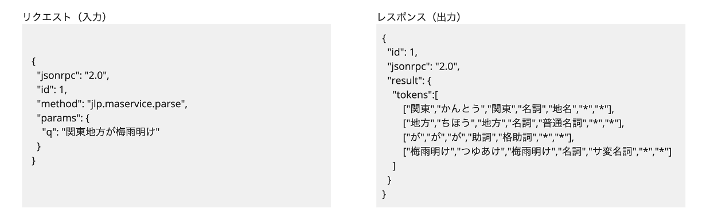
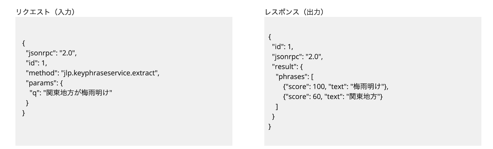
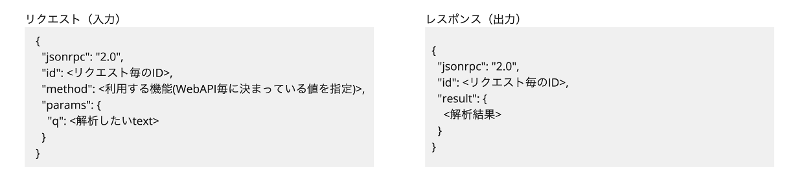

# 本クックブックの概要 

近年インターネットの発展とともに私たちは、メール、ウェブ検索、SNS の投稿、ニュース記事など、数多くのテキスト情報に触れています。これらのテキスト情報を効率的に処理し、意味を理解することは、私たちにとっては自然なことかもしれませんが、コンピューターにとっては非常に複雑なタスクです。

自然言語処理は、私たち人間が日常的に読み書きしたり、話したりするのに使っている言葉（=自然言語）をコンピューターが理解し、処理するための技術です。その可能性は広範囲にわたり、自動翻訳やテキスト分類、感情分析、質問応答システムなど、多くの応用分野でも活躍しています。

LINEヤフー株式会社では、自然言語処理で便利に使えるテキスト解析ツールを Web API として提供しています。本クックブックでは、このテキスト解析 Web API の仕様や活用について紹介していきます。また、仕様を確認できるコードや簡単に試せる活用サンプルを示すことで、誰でも気軽に自然言語処理を始められるように努めています。こちらのクックブックが新たなアイデアを生み出すきっかけとなれば幸いです。

## 各章の概要と読み方

第2章では、下記テキスト解析 Web API の仕様を実際のコード例を用いて、網羅的に解説しています。

- [日本語形態素解析](https://developer.yahoo.co.jp/webapi/jlp/ma/v2/parse.html)
- [かな漢字変換](https://developer.yahoo.co.jp/webapi/jlp/jim/v2/conversion.html)
- [ルビ振り](https://developer.yahoo.co.jp/webapi/jlp/furigana/v2/furigana.html)
- [校正支援](https://developer.yahoo.co.jp/webapi/jlp/kousei/v2/kousei.html)
- [日本語係り受け解析](https://developer.yahoo.co.jp/webapi/jlp/da/v2/parse.html)
- [キーフレーズ抽出](https://developer.yahoo.co.jp/webapi/jlp/keyphrase/v2/extract.html)
- [自然言語理解](https://developer.yahoo.co.jp/webapi/jlp/nlu/v2/index.html)

第3章では、これら Web API を使った活用事例を紹介します。実際のサンプルコードも置いていますので、簡単に試すことができます。

本クックブックの読み方として、テキスト解析 Web API の特定の機能やテーマについて学びたい方は、該当する記事から読み始めていただくことも可能です。各記事は独立しているため、興味のあるテーマだけを選んで学習できます。また多数サンプルコードを含んでいますので、コードの部分から読み始めても問題ありません。

## 想定している読者

本クックブックでは下記のような読者を想定しています。  
豊富なサンプルコードを用意していますので、プログラミング経験の浅い方でも、すぐに試せるでしょう。

- 昨今台頭してきた大規模言語モデル等の生成 AI をキャッチアップするべく、自然言語処理について初歩から学びたい IT/ウェブエンジニアの方
- 大学・独学等で自然言語処理を学び、IT/ウェブ企業での実応用例について詳しく知りたい学生・若手エンジニアの方
- テキストデータを扱う業務に携わっており、日本語テキストの分析などをしたいテキストマイニング初学者の方
- 機械学習を業務などで扱っており、日本語テキストを特徴量に組み込みたい機械学習初学者の方

## 本クックブックで扱う テキスト解析 Web API について

本クックブックでは、Yahoo!デベロッパーネットワークから公開している「[テキスト解析 Web API](https://developer.yahoo.co.jp/webapi/jlp/)」を扱います。  
Web API （Web Application Programming Interface）とは、Web アプリケーションが他のアプリケーションやサービスと通信するためのインターフェースです。LINEヤフー株式会社では、2007年6月に日本語形態素解析を公開してから、現在では複数の異なる自然言語処理機能を提供しています。これらは多くの方々から活用され、日々大量の解析リクエストを処理しています。

### Web API 形式のメリット

Web API 形式のテキスト解析では、主に以下のようなメリットが得られると考えています。

1. インストールなしで使える  
   通常、形態素解析など言語解析ツールを利用しようとすると利用者側でインストールや設定が必要になりますが、Web API 形式でのテキスト解析ツールでは、特にこれらは必要なく手軽に使えます。
   また解析にかかる計算リソースも意識しなくても良くなり、ローカルのコンピューティングリソースを節約できます。
2. とくに意識しなくても最新のモデルが使える  
   Web API 側でモデルのアップデートやメンテナンスを行うため、利用者は特に更新を気にすることなく、常に最新版を利用できます。
3. 柔軟な組み込みができる  
   Web API 形式で提供されており、他のアプリケーションやサービスに柔軟に組み込めます。ネットワークにつながる環境であれば利用できるため、スマートフォンアプリなどからでも利用可能です。また利用者側のプラットフォームやプログラミング言語も、どのようなものでも構いません。

これらのメリットにより、利用者は手軽に、そして手間をかけずにテキスト解析ツールを利用できます。

### 採用しているインターフェース 〜 JSON-RPC 2.0 〜

テキスト解析 Web API は、入出力インターフェースとして [JSON-PRC 2.0](https://www.jsonrpc.org/specification) を採用しており、入出力仕様を共通化しています。  
下記の図は、日本語形態素解析とキーフレーズ抽出のリクエスト（入力）とレスポンス（出力）の例です。リクエストとレスポンスがいずれも JSON で記述されています。またどちらの Web API もリクエストがほぼ同じ形式になっています。

- 日本語形態素解析の入出力例  
  
- キーフレーズ抽出の入出力例  
  

先のリクエストとレスポンスの例はいずれも JSON-RPC 2.0 に従う下記の形式になっています。

従来、Web API のインターフェースというと、解析方法の指定や解析結果の利用の方法を詳しく正確に知らなければ利用できませんでした。
しかし、テキスト解析 Web API で採用している JSON-RPC 2.0 に基づく方法では、処理を指定する “method” の名前とリクエスト、レスポンスの JSON を理解すればよく、開発者が Web API を容易に利用できるようになっています。またこの流れを理解すれば、日本語形態素解析以外の他の機能（例: キーフレーズ抽出やルビ振り、校正支援など）を利用する場合でも同じ方法が使えます。

参考：

- Yahoo! JAPAN Tech Blog「言語処理 API 共通化の取り組み〜インターフェース共通化」
  https://techblog.yahoo.co.jp/entry/2020091730016720/
- Yahoo! JAPAN Tech Blog「言語処理 API のインターフェースを共通化、その背景とメリット」
  https://techblog.yahoo.co.jp/entry/2022122430379919/

このようにインターフェースの共通化で、利用者が各機能の仕様を把握しやすくなり、 Web API の扱いも一層容易となっています。
