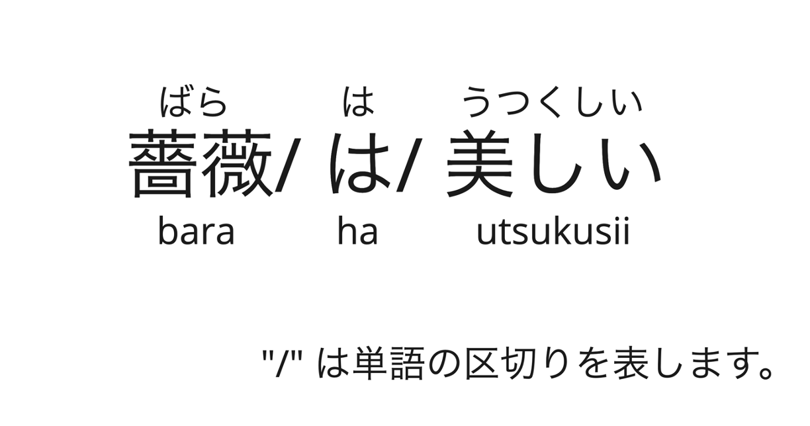

# ルビ振り

テキスト解析 Web API のルビ振りは、漢字かな交じり文にひらがなとローマ字のふりがな（ルビ）を付けます。 

「薔薇は美しい」という例文で説明します。
まず、文節ごとに区切られます。そして、ひらがなのふりがな「ばら は  うつくしい」（図中の文の上部）とローマ字のふりがな「bara ha utsukusii」（図中の文の下部）が結果として得られます。



ここでは、ルビ振りの機能について、公式ページの情報の抜粋（基本情報）と「できること」視点での利用例をあげていきます。

公式ページ:

- ルビ振り（V2）- Yahoo!デベロッパーネットワーク
  - https://developer.yahoo.co.jp/webapi/jlp/furigana/v2/furigana.html

## 基本情報

### リクエスト URL

```
https://jlp.yahooapis.jp/FuriganaService/V2/furigana
```

### リクエストパラメータ

| パラメータ           | 値             | 説明                                                                                                                                                                                                                                                                                                                                                                                                                                                                                                                                                                                    |
| -------------------- | -------------- | --------------------------------------------------------------------------------------------------------------------------------------------------------------------------------------------------------------------------------------------------------------------------------------------------------------------------------------------------------------------------------------------------------------------------------------------------------------------------------------------------------------------------------------------------------------------------------------- |
| id（必須）           | string,integer | 例: 1-234-D                                                                                                                                                                                                                                                                                                                                                                                                                                                                                                                                                                             |
| jsonrpc（必須）      | string         | 2.0（固定）                                                                                                                                                                                                                                                                                                                                                                                                                                                                                                                                                                             |
| method（必須）       | string         | jlp.furiganaservice.furigana（固定）                                                                                                                                                                                                                                                                                                                                                                                                                                                                                                                                                    |
| params（必須）       | object         |                                                                                                                                                                                                                                                                                                                                                                                                                                                                                                                                                                                         |
| params/q（必須）     | string         | 解析対象テキスト                                                                                                                                                                                                                                                                                                                                                                                                                                                                                                                                                                        |
| params/grade（任意） | integer        | 学年（注1）の指定について<br>1: 小学1年生向け。漢字（注2）にふりがなを付けます<br>2: 小学2年生向け。1年生で習う漢字にはふりがなを付けません<br>3: 小学3年生向け。1～2年生で習う漢字にはふりがを付けません<br>4: 小学4年生向け。1～3年生で習う漢字にはふりがなを付けません<br>5: 小学5年生向け。1～4年生で習う漢字にはふりがなを付けません<br>6: 小学6年生向け。1～5年生で習う漢字にはふりがなを付けません<br>7: 中学生以上向け。小学校で習う漢字にはふりがなを付けません<br>8: 一般向け。常用漢字にはふりがなを付けません<br>無指定の場合、ひらがなを含むテキストにふりがなを付けます。 |

注1：学年は「小学校学習指導要領」の付録「学年別漢字配当表」（1989年3月15日文部科学省告示。1992年4月施行）を参考に設定されています。

注2：JIS X 0208 が定める漢字です。

### レスポンスフィールド

| フィールド                   | 値              | 説明                                                                         |
| ---------------------------- | --------------- | ---------------------------------------------------------------------------- |
| id                           | string,integer  | リクエストの id の値が返ります                                               |
| jsonrpc                      | string          | 固定で「"2.0"」が返ります                                                    |
| result                       | object          | ふりがなを付けた結果                                                         |
| result/word                  | array（object） | 単語（注 3）のリスト                                                         |
| result/word/surface          | string          | 単語の表記                                                                   |
| result/word/furigana         | string          | 単語のひらがなのふりがな                                                     |
| result/word/roman            | string          | 単語のローマ字のふりがな                                                     |
| result/word/subword          | array（object） | 単語が漢字かな交じりのとき、その単語を漢字部分とひらがな部分で分割したリスト |
| result/word/subword/surface  | string          | 単語の表記                                                                   |
| result/word/subword/furigana | string          | 単語のひらがなのふりがな                                                     |
| result/word/subword/roman    | string          | 単語のローマ字のふりがな                                                     |

注 3: 単語は、このサービス独自の区切り方となり、形態素とは異なるものです。

### サンプルリクエストとレスポンス

公式ページにあるサンプルリクエストです。

```json
{
  "id": "1234-1",
  "jsonrpc": "2.0",
  "method": "jlp.furiganaservice.furigana",
  "params": {
    "q": "漢字かな交じり文にふりがなを振ること。",
    "grade": 1
  }
}
```

id は自由、jsonrpc は必ず "2.0"、method はルビ振りでは "jlp.furiganaservice.furigana" です。  
params/q には解析したいテキストを、params/grade でふりがなを振る範囲をセットするだけです。

上記リクエストに対するレスポンスです。

```json
{
  "id": "1234-1",
  "jsonrpc": "2.0",
  "result": {
    "word": [
      { "furigana": "かんじ", "roman": "kanzi", "surface": "漢字" },
      {
        "furigana": "かなまじり",
        "roman": "kanamaziri",
        "subword": [
          { "furigana": "かな", "roman": "kana", "surface": "かな" },
          { "furigana": "ま", "roman": "ma", "surface": "交" },
          { "furigana": "じり", "roman": "ziri", "surface": "じり" }
        ],
        "surface": "かな交じり"
      },
      { "furigana": "ぶん", "roman": "bun", "surface": "文" },
      { "surface": "に" },
      { "surface": "ふりがな" },
      { "surface": "を" },
      {
        "furigana": "ふる",
        "roman": "huru",
        "subword": [
          { "furigana": "ふ", "roman": "hu", "surface": "振" },
          { "furigana": "る", "roman": "ru", "surface": "る" }
        ],
        "surface": "振る"
      },
      { "surface": "こと" },
      { "surface": "。" }
    ]
  }
}
```

result/word がふりがなの結果が入った単語のリストです。

それぞれの単語の結果には、ひらがなのふりがな（furigana）、ローマ字のふりがな（roman）、表記（surface）を持っています。

かな漢字が交じる単語には、漢字部分とひらがな部分で分割した結果（subword）を持っています。

## 利用例

curl と jq を用いて「できること」を実行していきます。

実行例:

```bash
curl -s -X POST \
-H "Content-Type: application/json" \
-H "User-Agent: Yahoo AppID: 'あなたの Client ID（アプリケーション ID）'" \
https://jlp.yahooapis.jp/FuriganaService/V2/furigana \
-d '{
  "id": "1",
  "jsonrpc": "2.0",
  "method": "jlp.furiganaservice.furigana",
  "params": {
    "q": "漢字かな交じり文にふりがなを振ること。",
    "grade": 1
  }
}' | jq -c '.result.word[] | del(.subword)'
```

（※）Client ID については[こちら](../02_API_Specifications/00_Overview.md#client-idアプリケーション-id)をご覧ください。

実行結果（jq で results/word のみを取り出しています（subword は非表示））:

```json
{"furigana":"かんじ","roman":"kanzi","surface":"漢字"}
{"furigana":"かなまじり","roman":"kanamaziri","surface":"かな交じり"}
{"furigana":"ぶん","roman":"bun","surface":"文"}
{"surface":"に"}
{"surface":"ふりがな"}
{"surface":"を"}
{"furigana":"ふる","roman":"huru","surface":"振る"}
{"surface":"こと"}
{"surface":"。"}
```

### 小学校で習う漢字にはふりがなを振らない

実行例:

```bash
curl -s -X POST \
-H "Content-Type: application/json" \
-H "User-Agent: Yahoo AppID: 'あなたの Client ID（アプリケーション ID）'" \
https://jlp.yahooapis.jp/FuriganaService/V2/furigana \
-d '{
  "id": "1",
  "jsonrpc": "2.0",
  "method": "jlp.furiganaservice.furigana",
  "params": {
    "q": "漢字かな交じり文にふりがなを振ること。",
    "grade": 7
  }
}' | jq -c '.result.word[] | del(.subword)'
```

実行結果:

```json
{"surface":"漢字"}
{"surface":"かな交じり"}
{"surface":"文"}
{"surface":"に"}
{"surface":"ふりがな"}
{"surface":"を"}
{"furigana":"ふる","roman":"huru","surface":"振る"}
{"surface":"こと"}
{"surface":"。"}
```

入力パラメータの params.grage で 7 を指定することで、中学生以上で習う漢字のみにふりがなを振るようになります。

### ひらがなのふりがなに変換

実行例:

```bash
curl -s -X POST \
-H "Content-Type: application/json" \
-H "User-Agent: Yahoo AppID: 'あなたの Client ID（アプリケーション ID）'" \
https://jlp.yahooapis.jp/FuriganaService/V2/furigana \
-d '{
  "id": "1",
  "jsonrpc": "2.0",
  "method": "jlp.furiganaservice.furigana",
  "params": {
    "q": "漢字かな交じり文にふりがなを振ること。",
    "grade": 1
  }
}' | jq -r '[.result.word[] | .furigana // .surface] | join(" ")'
```

実行結果:

```
かんじ かなまじり ぶん に ふりがな を ふる こと 。
```

「、」「。」などふりがながないものはそのまま表示させています。

### ローマ字のふりがなに変換

実行例:

```bash
curl -s -X POST \
-H "Content-Type: application/json" \
-H "User-Agent: Yahoo AppID: 'あなたの Client ID（アプリケーション ID）'" \
https://jlp.yahooapis.jp/FuriganaService/V2/furigana \
-d '{
  "id": "1",
  "jsonrpc": "2.0",
  "method": "jlp.furiganaservice.furigana",
  "params": {
    "q": "漢字かな交じり文にふりがなを振ること。",
    "grade": 1
  }
}' | jq -r '[.result.word[] | .roman | select(. != null)] | join(" ")'
```

実行結果:

```
kanzi kanamaziri bun ni hurigana wo huru koto
```

「、」「。」などふりがながないものは非表示にしています。

## こちらの機能の活用事例

- [ブラウザで選択したテキストにルビを振る Chrome 拡張機能](../03_API_Examples/07_FuriganaService_ChromeExtension.md)
- [テキストの難易度判定](../03_API_Examples/07_FuriganaService_SentenceLevel.md)
- [ルビ振り・かな漢字変換を用いたクエリ拡張](../03_API_Examples/08_FuriganaServiceJIMService_QueryExpansion.ipynb)
