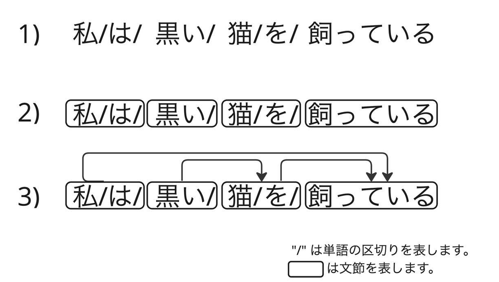

# 日本語係り受け解析

テキスト解析 Web API の日本語係り受け解析は、日本語文を文節に区切り、文節間の係り受け構造を解析します。

具体的には、文を意味的にまとまった単位である「文節」に区切り、それら文節がどのような関係にあるのか明確にします。以下に3つの例を示します。  
それぞれの例は、  
- 1）形態素解析による単語区切りの例  
- 2）文節にまとめた例  
- 3）文節間の関係を表す例

を表します。 



2）の文節は、一つ以上の単語が集まってできています。3）の矢印は、文節同士のつながりを示し、係り元から係り先への関係を表しています。日本語係り受け解析では、主に 3）のような文節の関係を把握します。


ここでは、日本語係り受け解析の機能について、公式ページの情報の抜粋（基本情報）と「できること」視点での利用例をあげていきます。

公式ページ:

- 日本語係り受け解析（V2）- Yahoo!デベロッパーネットワーク
  - https://developer.yahoo.co.jp/webapi/jlp/da/v2/parse.html

## 基本情報

### リクエスト URL

```
https://jlp.yahooapis.jp/DAService/V2/parse
```

### リクエストパラメータ

| パラメータ       | 値             | 説明                                        |
| ---------------- | -------------- | ------------------------------------------- |
| id（必須）       | string,integer | 例: 1-234-D                                 |
| jsonrpc（必須）  | string         | 2.0（固定）                                 |
| method（必須）   | string         | jlp.daservice.parse（固定）                 |
| params（必須）   | object         |                                             |
| params/q（必須） | string         | 解析対象テキスト、解析可能な単位は 1 文のみ |

### レスポンスフィールド

| フィールド             | 値              | 説明                                                          |
| ---------------------- | --------------- | ------------------------------------------------------------- |
| id                     | string,integer  | リクエストの id の値が返ります                                |
| jsonrpc                | string          | 固定で「"2.0"」が返ります                                     |
| result                 | object          | 係り受け解析結果                                              |
| result/chunks          | array（object） | 文節のリスト                                                  |
| result/chunks/id       | integer         | 文節の番号                                                    |
| result/chunks/head     | integer         | 係り先の文節番号<br/>係り先が存在しない場合は「-1」が返ります |
| result/chunks/tokens   | array（array）  | 形態素情報のリスト                                            |
| result/chunks/tokens/0 | string          | （形態素情報）表記                                            |
| result/chunks/tokens/1 | string          | （形態素情報）読み                                            |
| result/chunks/tokens/2 | string          | （形態素情報）基本形表記                                      |
| result/chunks/tokens/3 | string          | （形態素情報）品詞                                            |
| result/chunks/tokens/4 | string          | （形態素情報）品詞細分類                                      |
| result/chunks/tokens/5 | string          | （形態素情報）活用型                                          |
| result/chunks/tokens/6 | string          | （形態素情報）活用形                                          |

### サンプルリクエストとレスポンス

公式ページにあるサンプルリクエストです。

```json
{
  "id": "1234-1",
  "jsonrpc": "2.0",
  "method": "jlp.daservice.parse",
  "params": {
    "q": "青空にたくさんの気球が浮かんでいた"
  }
}
```

id は自由、jsonrpc は必ず "2.0"、method は日本語係り受け解析では "jlp.daservice.parse" です。  
解析したいテキストを params/q にセットするだけです。

上記リクエストに対するレスポンスです。

```json
{
  "id": "1234-1",
  "jsonrpc": "2.0",
  "result": {
    "chunks": [
      {
        "head": 3,
        "id": 0,
        "tokens": [
          ["青空", "あおぞら", "青空", "名詞", "普通名詞", "*", "*"],
          ["に", "に", "に", "助詞", "格助詞", "*", "*"]
        ]
      },
      {
        "head": 2,
        "id": 1,
        "tokens": [
          ["たくさんの", "たくさんの", "たくさんだ", "形容詞", "*", "ナノ形容詞", "ダ列特殊連体形"]
        ]
      },
      {
        "head": 3,
        "id": 2,
        "tokens": [
          ["気球", "ききゅう", "気球", "名詞", "普通名詞", "*", "*"],
          ["が", "が", "が", "助詞", "格助詞", "*", "*"]
        ]
      },
      {
        "head": -1,
        "id": 3,
        "tokens": [
          ["浮かんで", "うかんで", "浮かぶ", "動詞", "*", "子音動詞バ行", "タ系連用テ形"],
          ["いた", "いた", "いる", "接尾辞", "動詞性接尾辞", "母音動詞", "タ形"]
        ]
      }
    ]
  }
}
```

## 利用例

curl と jq を用いて「できること」を実行していきます。

実行例:

```bash
curl -s -X POST \
-H "Content-Type: application/json" \
-H "User-Agent: Yahoo AppID: 'あなたの Client ID（アプリケーション ID）'" \
https://jlp.yahooapis.jp/DAService/V2/parse \
-d '{
  "id": "1",
  "jsonrpc": "2.0",
  "method": "jlp.daservice.parse",
  "params": {
    "q": "青空にたくさんの気球が浮かんでいた"
  }
}' | jq -c '.result.chunks[]'
```

（※）Client ID については[こちら](../02_API_Specifications/00_Overview.md#client-idアプリケーション-id)をご覧ください。

実行結果（jq で results/chunks のみを取り出しています）:

```json
{"head": 3, "id": 0, "tokens": [["青空", "あおぞら", "青空", "名詞", "普通名詞", "*", "*"], ["に", "に", "に", "助詞", "格助詞", "*", "*"]]}
{"head": 2, "id": 1, "tokens": [["たくさんの", "たくさんの", "たくさんだ", "形容詞", "*", "ナノ形容詞", "ダ列特殊連体形"]]}
{"head": 3, "id": 2, "tokens": [["気球", "ききゅう", "気球", "名詞", "普通名詞", "*", "*"], ["が", "が", "が", "助詞", "格助詞", "*", "*"]]}
{"head": -1, "id": 3, "tokens": [["浮かんで", "うかんで", "浮かぶ", "動詞", "*", "子音動詞バ行", "タ系連用テ形"], ["いた", "いた", "いる", "接尾辞", "動詞性接尾辞", "母音動詞", "タ形"]]}
```

### 文節区切りにする

実行例:

```bash
curl -s -X POST \
-H "Content-Type: application/json" \
-H "User-Agent: Yahoo AppID: 'あなたの Client ID（アプリケーション ID）'" \
https://jlp.yahooapis.jp/DAService/V2/parse \
-d '{
  "id": "1",
  "jsonrpc": "2.0",
  "method": "jlp.daservice.parse",
  "params": {
    "q": "私は黒い猫を飼っている"
  }
}' | jq -r '[.result.chunks[].tokens | [.[][0]] | add] | join(" ")'
```

実行結果:

```
私は 黒い 猫を 飼っている
```

### 文節 id、係り先の文節 id、文節の文字列 を CSV で出力

実行例:

```bash
curl -s -X POST \
-H "Content-Type: application/json" \
-H "User-Agent: Yahoo AppID: 'あなたの Client ID（アプリケーション ID）'" \
https://jlp.yahooapis.jp/DAService/V2/parse \
-d '{
  "id": "1",
  "jsonrpc": "2.0",
  "method": "jlp.daservice.parse",
  "params": {
    "q": "雨上がりの空に美しい虹が見えた"
  }
}' | jq -r '.result.chunks[] | [.id, .head, ([.tokens[][0]] | add)] | @csv'
```

実行結果:

```
0,1,"雨上がりの"
1,4,"空に"
2,3,"美しい"
3,4,"虹が"
4,-1,"見えた"
```

文節 id、係り先の文節 id、文節の文字列の3カラムとなっています。  
"雨上がりの"は、文節 id=1 である"空に"に係っており、"空に"は、文節 id=4 である"見えた"に係っていることが分かります。

## こちらの機能の活用事例

- [係り受け解析を用いた簡単な文章要約](../03_API_Examples/05_DAService_Summary.md)
- [係り受け解析の結果を可視化](../03_API_Examples/05_DAService_Visualization.ipynb)
