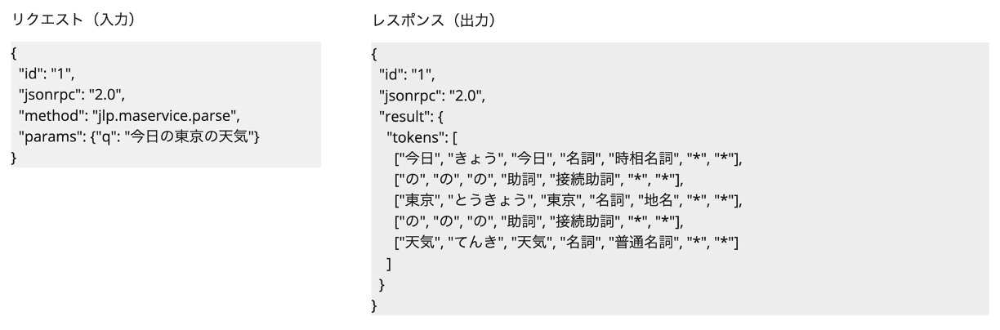

# バッチリクエストでクライアント側の HTTP 接続回数を減らす方法

ここではテキスト解析 Web API への複数の呼び出しを一括で行い、クライアント側の HTTP 接続の回数を減らす方法について説明します。  
この方法は Yahoo!デベロッパーネットワークの[テキスト解析 Web API](https://developer.yahoo.co.jp/webapi/jlp/) の全ての機能（日本語形態素解析、キーフレーズ抽出、ルビ振りなど）で利用可能な方法です。

通常、複数の文章を解析する場合、複数回リクエストを送るのが一般的かと思います。すると毎回のリクエストごとに HTTP のオーバーヘッドが生じるため、パフォーマンスが下がると考えられます。
しかし、テキスト解析 Web API はバッチリクエストをサポートしており、これにより複数の呼び出しを一回の HTTP リクエストに結合することが可能です。

## バッチリクエストの詳細

### バッチリクエストとは？

バッチリクエストは以下のような特徴があります。

- 一回のリクエストにの複数の呼び出しをまとめられます
- 各呼び出しは独立して実行されるため、一部の呼び出しが失敗しても、他の呼び出しは影響を受けずに実行されます
- 各呼び出しの順序に制約がないため、レスポンス結果の順序は入力の順序と変わることがあります
- 各呼び出しに対するレスポンスは、リクエスト時に指定した id で対応がとれます

### リクエスト/レスポンスは？

リクエストやレスポンスについてのポイントは、以下の通りです。日本語形態素解析をバッチリクエストでリクエストする例も載せていますので、あわせてご覧ください。

- リクエストのポイント
  - HTTP ヘッダーやリクエスト URL は、（バッチリクエストではない）通常時と同じです
  - リクエスト JSON を Array 形式 にします
  - リクエスト JSON の Array の各要素内の id は、他の要素の id と被らない、ユニークな値にしておきます（※）
- レスポンスのポイント
  - HTTP ステータスコードの仕様は、（バッチリクエストではない）通常時と同じです
  - レスポンス JSON は Array 形式で返却されます
  - どのリクエストに対するレスポンスなのかは、 id で判断します

（※） JSON-RPC 2.0 の仕様では id が他の要素の id と重複しても問題ありません。しかし、同じ id を複数回使用すると、呼び出し側がどのリクエストに対するレスポンスなのか区別することができなくなってしまいます。そのため、 id はユニークにしておくことがポイントです。

### 具体例

ここでは、テキスト解析 Web API の「[日本語形態素解析](https://developer.yahoo.co.jp/webapi/jlp/ma/v2/parse.html)」をバッチリクエストで送るサンプルを紹介します。

#### 通常のリクエスト例

まず下記で通常のリクエスト、レスポンスの例を見てみましょう。



#### バッチリクエストの例（リクエストを1つにまとめる場合）

続いて、バッチリクエストで2つの入力を1つのリクエストにまとめてみます。下記のように Array 形式で複数の入力をまとめられます。

- リクエスト：id = "1", "2" で別々の文章（`params/q`）を指定しています
- レスポンス：id = "1", "2" それぞれに対して解析結果が返却されます


#### バッチリクエストの例（まとめたリクエストの一部がエラーの場合）

次はバッチリクエストで2つの入力を1つのリクエストにまとめる例ですが、一部がエラーの場合のレスポンスを見てみましょう。

- リクエスト：id = "2" は誤った method 名を指定しています
- レスポンス：id = "1" は正常に処理され、 id = "2" のみエラーが返却されます


バッチリクエストはこのように複数の入力を一回のリクエストにまとめられます。またレスポンスは入力の id それぞれに対応したもの（エラーの場合も）が返ってきます。


#### jq による実行例

バッチリクエストで2つの文を形態素解析し、
それぞれの解析結果から表記と品詞のリストを出力します。

```bash
curl -s -X POST \
-H "Content-Type: application/json" \
-H "User-Agent: Yahoo AppID: 'あなたの Client ID（アプリケーション ID）'" \
https://jlp.yahooapis.jp/MAService/V2/parse \
-d '[
  {
    "id": "1",
    "jsonrpc": "2.0",
    "method": "jlp.maservice.parse",
    "params": {"q": "今日の東京の天気"}
  },
  {
    "id": "2",
    "jsonrpc": "2.0",
    "method": "jlp.maservice.parse",
    "params": {"q": "明日の東京の気温"}
  }
]' | jq -c '.[] | [.result.tokens[] | [.[0,3]]]'
```
実行結果:
```json
[["今日","名詞"],["の","助詞"],["東京","名詞"],["の","助詞"],["天気","名詞"]]
[["明日","名詞"],["の","助詞"],["東京","名詞"],["の","助詞"],["気温","名詞"]]
```

（※）Client ID については[こちら](../02_API_Specifications/00_Overview.md#client-idアプリケーション-id)をご覧ください。

### 注意点

バッチリクエストでのリクエストボディの最大サイズは、各機能で許可している最大値です。具体的な最大値は、下記の各機能の仕様ページにてご確認ください。

- [日本語形態素解析](https://developer.yahoo.co.jp/webapi/jlp/ma/v2/parse.html)
- [かな漢字変換](https://developer.yahoo.co.jp/webapi/jlp/jim/v2/conversion.html)
- [ルビ振り](https://developer.yahoo.co.jp/webapi/jlp/furigana/v2/furigana.html)
- [校正支援](https://developer.yahoo.co.jp/webapi/jlp/kousei/v2/kousei.html)
- [日本語係り受け解析](https://developer.yahoo.co.jp/webapi/jlp/da/v2/parse.html)
- [キーフレーズ抽出](https://developer.yahoo.co.jp/webapi/jlp/keyphrase/v2/extract.html)
- [自然言語理解](https://developer.yahoo.co.jp/webapi/jlp/nlu/v2/index.html)

## 使用しているテキスト解析 Web API

- [日本語形態素解析](../02_API_Specifications/01_MAService.md)

（日本語形態素解析で事例を示しましたが、他のテキスト解析 Web API で も同様にバッチリクエストが利用できます。）

## 著者

LINEヤフー株式会社 言語処理エンジニア  
牧野 恵
