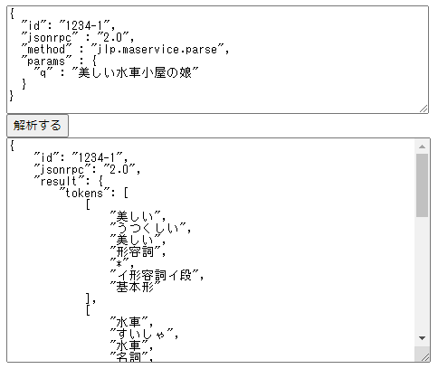

# テキスト解析 Web API をウェブページから直接使う方法

テキスト解析 Web API は CORS（Cross-Origin Resource Sharing）対応されているので、
別ドメインにあるウェブページ内の JavaScript プログラムから直接アクセスして利用できます。

動作確認用の簡単な HTML ページです。

```html
<!DOCTYPE html>
<html lang="ja">
  <head>
    <meta http-equiv="Content-Type" content="text/html;charset=UTF-8">
    <title>Y!API NLP demo forms</title>
    <style>
      textarea { width: 95%; height: 15rem; display: block; }
    </style>
    <script>
      const APPID = 'あなたの Client ID（アプリケーション ID）';
      function method2url(method) {
          let cs = method.split('.');
          const m = cs[1].match(/^((.)(.+))service$/);
          if (m[1].length <= 3) cs[1] = m[1].toUpperCase();
          else cs[1] = m[2].toUpperCase() + m[3];
          const version = cs[1].startsWith("NER") ? 1 :2;
          return url = `https://jlp.yahooapis.jp/${cs[1]}Service/V${version}/${cs[2]}`
      }
      function analyze() {
          const request = document.querySelector("#input-json").value;
          const json = JSON.parse(request);
          const end_point = method2url(json['method']);
          const url = end_point + "?appid=" + encodeURIComponent(APPID);
          fetch(url, {
              method: 'POST',
              body: request,
              mode: 'cors'
          }).then(res => res.json()).then(obj =>
              document.querySelector("#output-json").value = JSON.stringify(obj, null, 4)
          ).catch(console.error);
      }
    </script>
  </head>
  <body>
    <textarea id="input-json" placeholder="入力 JSON"></textarea>
    <button onclick="analyze()">解析する</button>
    <textarea id="output-json" placeholder="解析結果 JSON"></textarea>
  </body>
</html>
```

（※）Client ID については[こちら](../02_API_Specifications/00_Overview.md#client-idアプリケーション-id)をご覧ください。

ローカルに HTML ファイルを作成し（ファイル名は `jlp-simple.html` など）、上記内容を入力し、ウェブブラウザで開きます（[github にファイルあります](01_WebAPIGeneral_CORSProxy_src/jlp-simple.html)）。
そして、「入力 JSON」の箇所に
[テキスト解析 Web API の日本語形態素解析の公式ページ](https://developer.yahoo.co.jp/webapi/jlp/ma/v2/parse.html) にあるサンプルリクエストを入力し、
「解析する」ボタンを押します。
すると、プロキシ経由で返ってきた解析結果が「解析結果 JSON」の箇所に表示されます。

図: 動作確認用 HTML ページでの実行結果

[](https://yahoojapan.github.io/textwebapi-cookbook/03_API_Examples/01_WebAPIGeneral_CORSProxy_src/jlp-simple-id.html)

コード中の関数 `method2url` は「[リクエスト URL とリクエストパラメータの "method" の相互変換](01_WebAPIGeneral_URLAndMethod.md)」で説明した方法で、入力されたリクエスト中の method をリクエスト URL に変換します。
そのため、このデモでは形態素解析用のリクエストだけでなく、テキスト解析 Web API の他の機能（ルビ振り、校正支援、キーフレーズ抽出など）用のリクエストを入力しても対応します。

## 関連情報

本記事の内容に関連したもう少し詳しい解説を LINEヤフー Tech Blog に書いていますので、そちらもご覧ください。

- [テキスト解析 Web API を JavaScript から直接使う（ API が CORS に対応しました）](https://techblog.lycorp.co.jp/ja/20231016a)

また、本記事のコードを改良し、各機能ごとのサンプルリクエストをプルダウンで選択できるようにしたものを下記で利用できます。
テキスト解析 Web API の動作確認にどうぞ。

- [Y!API NLP demo forms](https://yahoojapan.github.io/textwebapi-cookbook/03_API_Examples/01_WebAPIGeneral_CORSProxy_src/jlp-id.html)

## 使用しているテキスト解析 Web API

- [日本語形態素解析](../02_API_Specifications/01_MAService.md)

## 著者

LINEヤフー研究所  
山下 達雄（[@yto](https://x.com/yto)）
