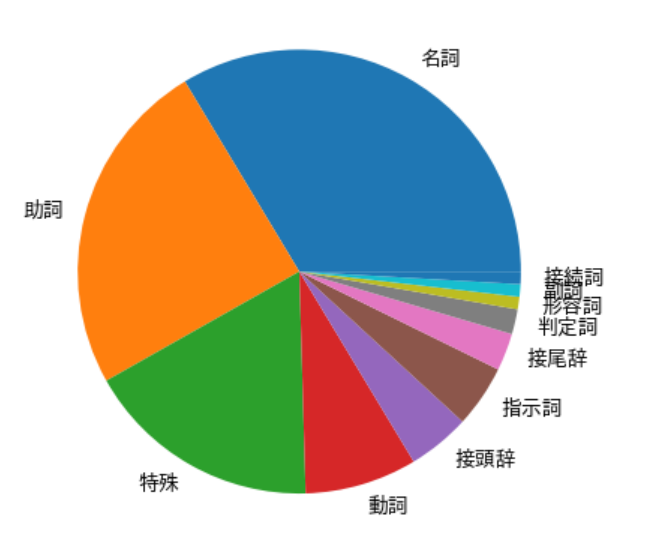
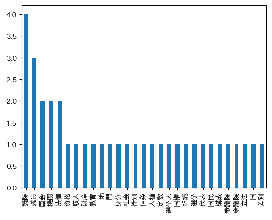

# 形態素や品詞の頻度を集計してグラフ化する

テキスト解析 Web API の日本語形態素解析を用いて、
日本語文に含まれる形態素の表記や品詞の頻度分布を調べましょう。
具体的には、Web API を用いて形態素解析を行い、その結果を集計して円グラフや棒グラフで視覚的に表示します。

Jupyter Lab / Jupyter Notebook / Google Colaboratory などで動かすことを念頭に置いた Python プログラムで流れを説明していきます。
ここでは実行環境の準備については割愛します。Google アカウントがあれば [Google Colaboratory](https://colab.research.google.com/?hl=ja) を使うのが手軽です。

以下、セルごとに解説していきます。

まずはじめに必要なモジュールを import します。

```python
import pandas as pd
import json
from urllib import request
import japanize_matplotlib
```

ないものは必要に応じて pip でインストールしてください。
特に japanize_matplotlib（グラフに日本語文字を出す）は入っていないことが多いので
別のセルで下記を実行してインストールしてください。

```
!pip install japanize_matplotlib
```

次に Web API にアクセスして形態素解析を行うための関数を定義します。
実装は[公式サイトにある Python のサンプルプログラム](https://developer.yahoo.co.jp/webapi/jlp/sample/sample14.html)とほぼ同じものです。

```python
APPID = "あなたの Client ID（アプリケーション ID）"
URL = "https://jlp.yahooapis.jp/MAService/V2/parse"
headers = {
    "Content-Type": "application/json",
    "User-Agent": "Yahoo AppID: {}".format(APPID),
}
param_dic = {
    "id": "1234-1",
    "jsonrpc": "2.0",
    "params": {}
}
def ma(query):
    param_dic['params']['q'] = query
    param_dic['method'] = "jlp.maservice.parse"
    params = json.dumps(param_dic).encode()
    req = request.Request(URL, params, headers)
    with request.urlopen(req) as res:
        body = res.read()
    return body.decode()
```

（※）Client ID については[こちら](../02_API_Specifications/00_Overview.md#client-idアプリケーション-id)をご覧ください。

日本語テキストを渡して形態素解析します。
結果は JSON 文字列なのでオブジェクトに変換しておきます。
ここで使用する例文は日本国憲法の一部です。

```python
# 日本語テキストを渡して形態素解析します
text = "国会は、国権の最高機関であって、国の唯一の立法機関である。\
国会は、衆議院及び参議院の両議院でこれを構成する。\
両議院は、全国民を代表する選挙された議員でこれを組織する。\
両議院の議員の定数は、法律でこれを定める。\
両議院の議員及びその選挙人の資格は、法律でこれを定める。\
但し、人種、信条、性別、社会的身分、門地、教育、財産又は収入によって差別してはならない。"
response = ma(text)

# 解析結果の JSON 文字列をオブジェクトに変換します
obj = json.loads(response)
```

解析結果の形態素情報部分を Pandas の DataFrame に格納します。正しく格納されたことを確認するため、先頭の5行を表形式で表示しています。

```python
# 解析結果の形態素情報部分を DataFrame にします
df = pd.DataFrame(
    obj['result']['tokens'],
    columns=['表記','読み','基本形','品詞','品詞細分類','活用型','活用形']
)
df.head()
```

|     | 表記 | 読み     | 基本形 | 品詞 | 品詞細分類 | 活用型 | 活用形 |
| --- | ---- | -------- | ------ | ---- | ---------- | ------ | ------ |
| 0   | 国会 | こっかい | 国会   | 名詞 | 普通名詞   | \*     | \*     |
| 1   | は   | は       | は     | 助詞 | 副助詞     | \*     | \*     |
| 2   | 、   | 、       | 、     | 特殊 | 読点       | \*     | \*     |
| 3   | 国権 | こっけん | 国権   | 名詞 | 普通名詞   | \*     | \*     |
| 4   | の   | の       | の     | 助詞 | 接続助詞   | \*     | \*     |

品詞の出現頻度を見てみます。下記では、上位5件の品詞とその出現頻度を表示しています。

```python
# 品詞の出現頻度（降順5件）
df['品詞'].value_counts().head()
```

```
名詞     37
助詞     27
特殊     19
動詞      9
接頭辞     5
```

品詞の出現頻度分布を円グラフで表示します。

```python
# 品詞の出現頻度グラフ
df['品詞'].value_counts().plot.pie(label='')
```



名詞だけの出現頻度を見てみます。
品詞が名詞である形態素の表記文字列の頻度を集計します。下記では、上位5件の名詞とその出現回数を表示しています。

```python
# 名詞の出現頻度（降順5件）
df[df['品詞'] == '名詞']['表記'].value_counts().head()
```

```
議院    4
議員    3
国会    2
機関    2
法律    2
```

名詞の出現頻度分布を棒グラフで表示します。

```python
# 名詞の出現頻度グラフ
df[df['品詞'] == '名詞']['表記'].value_counts().plot.bar()
```



以上です。

コードはこちらから入手できます:

- [MAService_FrequencyCount.ipynb](02_MAService_FrequencyCount_src/MAService_FrequencyCount.ipynb)

## 使用しているテキスト解析 Web API

- [日本語形態素解析](../02_API_Specifications/01_MAService.md)

## 著者

LINEヤフー研究所  
山下 達雄（[@yto](https://x.com/yto)）
