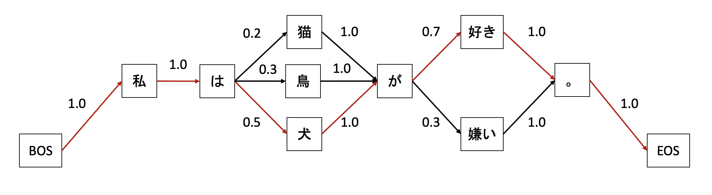

# マルコフ連鎖による文生成

ここでは、日本語形態素解析の活用事例の一つとして、マルコフ連鎖を活用した文生成を紹介します。

## マルコフ連鎖とは？

マルコフ連鎖は「A という単語の後には B という単語が続く」という関係をコーパスから学習してグラフを作成し、そのグラフを遷移していくことで文を生成するという手法です。実際に作成されるグラフの例は次のようになります。BOS と EOS はそれぞれ文の始まりと終わりを表す記号です。



## 実際に作ってみましょう

Jupyter Lab / Jupyter Notebook / Google Colaboratory などで動かすことを念頭に置いた Python プログラムで流れを説明していきます。
ここでは実行環境の準備については割愛します。Google アカウントがあれば [Google Colaboratory](https://colab.research.google.com/?hl=ja) を使うのが手軽です。
なお本プログラムは、[markov.py](./02_MAService_MarkovChain_src/markov.py) にも置いていますのでご活用ください。

まずはじめに必要なライブラリをインストールしましょう！  
`markovify` はマルコフモデルを作成してくれるライブラリです。`markovify` について詳しく知りたい方は [markovify](https://github.com/jsvine/markovify) を参照してください。

```bash
!pip install markovify
```

それでは実際に実装していきます。  
まずは、引数として与えられた文を日本語形態素解析の機能を使い、形態素に分割する関数 `tokenize_text` を定義します。この関数では、形態素の表層形を空白区切りで連結して返します。次に、`tokenize_text` を用いて形態素に分割したものからマルコフモデルを作成する関数 `generate_model` を定義します。

```python
import json
from urllib import request

import markovify

APPID = "あなたの Client ID（アプリケーション ID）"
URL = "https://jlp.yahooapis.jp/MAService/V2/parse"


# テキスト解析 Web API の日本語形態素解析へリクエストする
def post(query: str):
    headers = {
        "Content-Type": "application/json",
        "User-Agent": "Yahoo AppID: {}".format(APPID),
    }
    param_dic = {
        "id": "1234-1",
        "jsonrpc": "2.0",
        "method": "jlp.maservice.parse",
        "params": {"q": query},
    }
    params = json.dumps(param_dic).encode()
    req = request.Request(URL, params, headers)
    with request.urlopen(req) as res:
        body = res.read()
    return body.decode()


# 与えられたテキストを形態素に分割する（形態素の表層形をスペース区切りにして返す）
def tokenize_text(text: str):
    response = json.loads(post(text))
    return " ".join(token[0] for token in response["result"]["tokens"])


# コーパスからマルコフモデルを作成する
def generate_model(corpus: list[str]):
    tokenized_corpus = ""
    for text in corpus:
        tokenized_text = tokenize_text(text) + "\n"
        tokenized_corpus += tokenized_text
    markov_model = markovify.NewlineText(
        tokenized_corpus, state_size=1, retain_original=False
    )
    return markov_model
```

（※）Client ID については[こちら](../02_API_Specifications/00_Overview.md#client-id%E3%82%A2%E3%83%97%E3%83%AA%E3%82%B1%E3%83%BC%E3%82%B7%E3%83%A7%E3%83%B3id)をご覧ください。

次に実際にコーパスを用意してマルコフモデルを作成してみます。作成したマルコフモデルを使って、文を3回生成してみましょう。

```python
corpus = [
    "犬が嫌い。",
    "私は猫が好き。",
    "私は鳥が好き。",
    "私は犬が好き。",
    "僕は猿が好き。",
]
markov_model = generate_model(corpus)
for _ in range(3):
    sentence = markov_model.make_sentence().replace(" ", "")
    print(sentence)
```

実際に実行してみた例は次のようになります。コーパスに存在していない文が生成されていることが確認できます。

```shell
私は犬が好き。
私は猫が嫌い。
僕は犬が好き。
```

今回は次の単語を予測するときに直前の単語しか考慮していませんが、マルコフモデルを作成する際の引数である `state_size` を増やすことで、どの程度前の単語を考慮するか指定することができます。  
考慮する単語の数を増やすことで出力される文の流暢さは向上しますが、出力される文の多様性は失われてしまいます。そのため、その度合いを補うためにより多くの学習データが必要となります。  
ぜひ、コーパスの量を増やしたり、マルコフモデル作成時の `state_size` を調整したりして新たな文を生成してみてください。

## 使用しているテキスト解析 Web API

- [日本語形態素解析](../02_API_Specifications/01_MAService.md)

## 著者

LINEヤフー株式会社 言語処理エンジニア  
仲村 祐希
