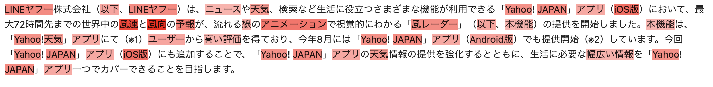

# キーフレーズ抽出の結果の可視化

テキスト解析 Web API のキーフレーズ抽出では、抽出されたキーフレーズごとに重要度を示すスコアも取得できます。本記事では、この重要度に基づいて文中のキーフレーズに色を付けることで、キーフレーズ抽出の結果を視覚的に表現する方法を紹介します。

## 可視化コード

Jupyter Lab / Jupyter Notebook / Google Colaboratory などで動かすことを念頭に置いた Python プログラムで流れを説明していきます。
ここでは実行環境の準備については割愛します。Google アカウントがあれば [Google Colaboratory](https://colab.research.google.com/?hl=ja) を使うのが手軽です。

では、具体的な実装を見ていきます。キーフレーズの色付けには HTML を利用し、重要度に応じてフレーズの背景色を濃くすることで、可視化を行います。
なお本プログラムは、[keyphrase_visualize.ipynb](./03_KeyphraseService_Visualization_src/keyphrase_visualize.ipynb) にも置いていますのでご活用ください。

```python
import json
from urllib import request
from IPython.display import HTML, display


# キーフレーズ抽出の結果からキーフレーズとその重要度を取得する関数
def extract_keyphrases(query: str) -> list[dict]:
    client_id = "あなたの Client ID（アプリケーション ID）"
    url = "https://jlp.yahooapis.jp/KeyphraseService/V2/extract"

    headers = {
        "Content-Type": "application/json",
        "User-Agent": f"Yahoo AppID: {client_id}",
    }

    param_dic = {
        "id": "1234-1",
        "jsonrpc": "2.0",
        "params": {
            "q": query,
        },
        "method": "jlp.keyphraseservice.extract",
    }

    params = json.dumps(param_dic).encode()
    req = request.Request(url, params, headers)

    with request.urlopen(req) as res:
        body = res.read()

    return json.loads(body.decode())["result"]["phrases"]


# 入力テキストのキーフレーズを可視化する関数
def visualize_keyphrase(text: str) -> None:
    # テキスト全体を<div>で囲むことで、HTML化
    display_text = f"<div>{text}</div>"

    # 入力テキストからキーフレーズとその重要度を取得
    phrases = extract_keyphrases(text)

    # CSSのrgbaメソッドを用いて、透明度を示すaを値をスコアに応じて変更しながら、背景に色を付ける
    for phrase in phrases:
        # キーフレーズ抽出のスコアのスケール(0~100)を、透明度を示すaのスケール(0~1)に合わせる
        score = phrase["score"] / 100
        word = phrase["text"]

        # 対象キーフレーズを、色付けのためのタグで囲んで、文字列の置換を行う
        emphasized_word = f"<span style='background-color: rgba(255, 0, 0, {score:.2f})'>{word}</span>"
        display_text = display_text.replace(word, emphasized_word)

    display(HTML(display_text))
```

（※）Client ID については[こちら](../02_API_Specifications/00_Overview.md#client-idアプリケーション-id)をご覧ください。


次に、実装した関数を用いて、以下の文章を視覚的に表現してみましょう。この文章はLINEヤフー株式会社の[プレスリリース](https://www.lycorp.co.jp/ja/news/release/000853/)から取り出した一例です。ご自身の状況に合わせて文章を変更して、試してみてください。

```python
text = "LINEヤフー株式会社（以下、LINEヤフー）は、ニュースや天気、検索など生活に役立つさまざまな機能が利用できる「Yahoo! JAPAN」アプリ（iOS版）において、最大72時間先までの世界中の風速と風向の予報が、流れる線のアニメーションで視覚的にわかる「風レーダー」（以下、本機能）の提供を開始しました。本機能は、「Yahoo!天気」アプリにて（※1）ユーザーから高い評価を得ており、今年8月には「Yahoo! JAPAN」アプリ（Android版）でも提供開始（※2）しています。今回「Yahoo! JAPAN」アプリ（iOS版）にも追加することで、「Yahoo! JAPAN」アプリの天気情報の提供を強化するとともに、生活に必要な幅広い情報を「Yahoo! JAPAN」アプリ一つでカバーできることを目指します。"

visualize_keyphrase(text)
```



このように、各キーフレーズをその重要度に応じて視覚的に表現することが可能です。特に長い文章に適用すると全体の概要をつかむのにも役立ちます。また、入力される文章によってキーフレーズの特徴は変わるため、ぜひ他の文章でも試してみてください。

## 使用しているテキスト解析 Web API

- [キーフレーズ抽出](../02_API_Specifications/06_KeyphraseService.md)

## 著者

LINEヤフー株式会社 言語処理エンジニア  
平子 潤
