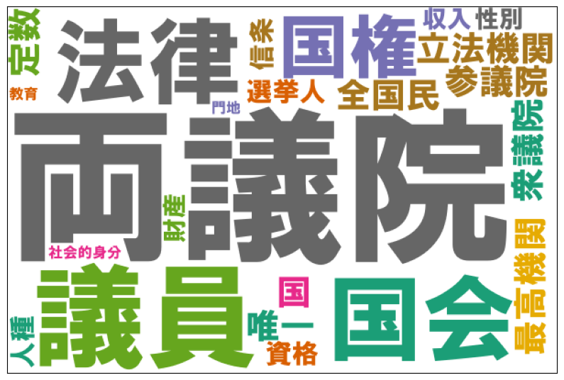

# キーフレーズを抽出してワードクラウドを作る

ワードクラウドとは、テキストに含まれる単語の視覚化手法の一つで、各単語を出現頻度や重要度に応じて文字サイズを変えて配置したものです。テキスト内容が一目で確認できて便利です。

ここでは、テキスト解析 Web API のキーフレーズ抽出を用いて、ワードクラウドを作ります。形態素より長めの意味のあるキーフレーズを使うことで、より分かりやすい表現になるかと思います。

Jupyter Lab / Jupyter Notebook / Google Colaboratory などで動かすことを念頭に置いた Python プログラムで流れを説明していきます。
ここでは実行環境の準備については割愛します。Google アカウントがあれば [Google Colaboratory](https://colab.research.google.com/?hl=ja) を使うのが手軽です。

以下、セルごとに解説していきます。

まず、テキスト解析 Web API のキーフレーズ抽出にアクセスする関数を定義します。テキストを渡すと抽出したキーフレーズを返します。

```python
import json
from urllib import request
APPID = "あなたの Client ID（アプリケーション ID）"
URL = "https://jlp.yahooapis.jp/KeyphraseService/V2/extract"
headers = {
    "Content-Type": "application/json",
    "User-Agent": "Yahoo AppID: {}".format(APPID),
}
param_dic = {
    "id": "1234-1",
    "jsonrpc": "2.0",
    "params": {}
}
def keyphrase_service(query):
    param_dic['params']['q'] = query
    param_dic['method'] = "jlp.keyphraseservice.extract"
    params = json.dumps(param_dic).encode()
    req = request.Request(URL, params, headers)
    with request.urlopen(req) as res:
        body = res.read()        
    return json.loads(body.decode())['result']['phrases']

# 動作テスト
keyphrase_service('そういえば夏休みに東京タワーに行ったのを思い出しました')
```

（※）Client ID については[こちら](../02_API_Specifications/00_Overview.md#client-idアプリケーション-id)をご覧ください。

動作テストの結果は下記になります。「夏休み」と「東京タワー」が取れています。

- 動作テストの出力
  ```
  [{'score': 100, 'text': '東京タワー'}, {'score': 80, 'text': '夏休み'}]
  ```

次に、サンプルのテキストをセットします。
ここでは、日本国憲法から取ってきた6つの文を使用します。

```python
sentences = [
    "国会は、国権の最高機関であって、国の唯一の立法機関である。",
    "国会は、衆議院及び参議院の両議院でこれを構成する。",
    "両議院は、全国民を代表する選挙された議員でこれを組織する。",
    "両議院の議員の定数は、法律でこれを定める。",
    "両議院の議員及びその選挙人の資格は、法律でこれを定める。",
    "但し、人種、信条、性別、社会的身分、門地、教育、財産又は収入によって差別してはならない。",
]
```

各文に対してキーフレーズ抽出を行い（`kps_list`） 、表層文字列のみを取り出し（`all_keyphrases`）、出現頻度を計算します （`ct_keyphrases`）。

```python
kps_list = [keyphrase_service(sentence) for sentence in sentences]

all_keyphrases = [kp['text'] for kps in kps_list for kp in kps]

import collections
ct_keyphrases = collections.Counter(all_keyphrases)
```

`ct_keyphrases` は Python の辞書形式で、下記のように各ワードの頻度が入っています。

- `ct_keyphrases` の中身
  ```
  {'両議院': 4, '議員': 3, '国会': 2, '法律': 2, '国権': 1, ...}
  ```

最後に、頻度情報を用いてワードクラウドを描画します。

```python
import matplotlib.pyplot as plt
from wordcloud import WordCloud

wordcloud = WordCloud(
    font_path='C:/Windows/Fonts/HGRSGU.TTC',
    background_color="white", width=600, height=400,
    collocations=False, colormap='Dark2', random_state=0
)
wordcloud.generate_from_frequencies(ct_keyphrase)

fig, ax = plt.subplots(1,1, figsize=(10,10))
ax.axes.xaxis.set_visible(False)
ax.axes.yaxis.set_visible(False)
ax.imshow(wordcloud)
```

このようなワードクラウド画像が表示されます。



`font_path` の指定がはまりどころなので設定例をあげておきます。

- Google Colaboratory: `/usr/share/fonts/opentype/ipafont-gothic/ipagp.ttf`
  - 事前に `!apt-get -y install fonts-ipafont-gothic` を実行
- Windows: `C:/Windows/Fonts/HGRSGU.TTC`
  - WSL: `/mnt/c/Windows/Fonts/HGRSGU.TTC`
- MacOS: `/Library/Fonts/Arial Unicode.ttf`
- Linux: `/usr/share/fonts/ipa-gothic/ipag.ttf`
  - インストールする場合は "python matplotlib 日本語" でウェブ検索！
  - fc-list コマンドでパスを確認できるのでそれを指定

以上です。

コードはこちらから入手できます:

- [KeyphraseService_Wordcloud.ipynb](03_KeyphraseService_Wordcloud_src/KeyphraseService_Wordcloud.ipynb)

## 使用しているテキスト解析 Web API

- [キーフレーズ抽出](../02_API_Specifications/06_KeyphraseService.md)

## 著者

LINEヤフー研究所  
山下 達雄（[@yto](https://x.com/yto)）
