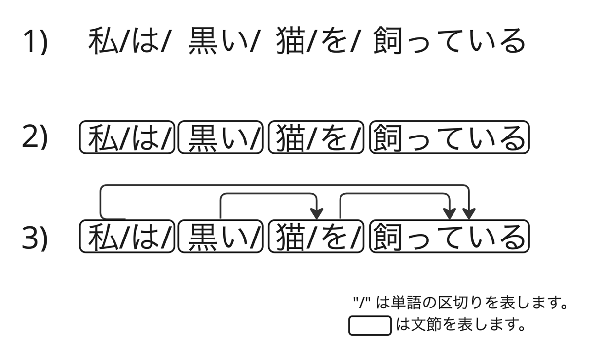

# 係り受け解析を用いた簡単な文章要約

本記事では、テキスト解析 Web API の日本語係り受け解析を用いた簡単な文章要約手法を紹介します。

この手法では、まず日本語文を係り受け解析します。
次に、どこにも係っていない文節とそこに直接係る文節だけを抜き出します。これにより修飾表現を削ぎ落とした要約文を作成します。

ただし、この手法では意図に沿う要約にならないことが多いため、実用的とは言い難いです。
そのため著者はこの手法を「なんちゃって文章要約」と呼んでいます。



さて、上記は
[テキスト解析 Web API の日本語係り受け解析の解説](../02_API_Specifications/05_DAService.md)で用いた図です。
この例文「私は黒い猫を飼っている」に対して前述の手法を適用してみます。  
まず「どこにも係ってない文節」は「飼っている」です。
そして、「飼っている」に直接係っている文節は「私は」と「猫を」です。
そのため、適用結果は「私は/猫を/飼っている」となります。
「猫を」に係っていた「黒い」は削除されます。

さて、これを実現するに長いプログラムは不要で、
実は jq だけでサクッと実現できてしまいます。

実行例です。例文は「うちの庭には大きな鶏がいます」です。

```bash
curl -s -X POST \
-H "Content-Type: application/json" \
-H "User-Agent: Yahoo AppID: 'あなたの Client ID（アプリケーション ID）'" \
-d '{
  "id": "1",
  "jsonrpc": "2.0",
  "method": "jlp.daservice.parse",
  "params": {
    "q": "うちの庭には大きな鶏がいます"
  }
}' \
https://jlp.yahooapis.jp/DAService/V2/parse | \
jq -cr '.result.chunks[].root_id = (.result.chunks[] | (select(.head == -1) | .id)) |
 [ .result.chunks[] | select(.head == -1 or .head == .root_id) | .tokens[][0] ] | join("")'
```

```
庭には鶏がいます
```

（※）Client ID については[こちら](../02_API_Specifications/00_Overview.md#client-idアプリケーション-id)をご覧ください。

「うちの庭には大きな鶏がいます」から「うちの」「大きな」が削除され、「います」とそれに直接係る文節だけからなる「庭には鶏がいます」が要約文として出力されました。

jq のコードの中身を簡単に解説します。
前半後半の2つの部分に分かれます。

前半は「どこにも係ってない文節」を探す処理です。
"head" がポイントです。

```
.result.chunks[].root_id = (.result.chunks[] |(select(.head == -1) | .id)) |
```

下記は係り受け解析結果の情報を抜粋したものです。
"id" が各文節のユニーク ID、"head" が各文節が係る先（ID）を表します。

```
{"head":1,"id":0,"tokens":[["うち","うち","うち","名詞",...],...]}
{"head":3,"id":2,"tokens":[["大きな","おおきな","大きな",...],...]}
{"head":4,"id":3,"tokens":[["鶏","にわとり","鶏","名詞",...],...]}
{"head":-1,"id":4,"tokens":[["い","い","いる","動詞","*",...],...]}
```

係る先がない文節、つまり "head" が -1 の文節が「どこにも係ってない文節」になります。
コードでは、"head" が -1 の文節の "id" を "root_id" としてすべての文節に追加しています。なぜ「すべて」に追加するのかというと、jq にはグローバル変数がないようなので、その代替手段なのです。

jq コードの後半は「どこにも係ってない文節」（.head == -1）と「どこにも係ってない文節」に係っている文節（.head == .root_id）のみを取り出す処理です。

```
[ .result.chunks[] | select(.head == -1 or .head == .root_id) | .tokens[][0] ] | join("")
```

対象となる文節を取り出した後、それぞれ文節に含まれるすべての形態素の表記だけを取り出して、最後につなげて「要約文」を出力します。

この「なんちゃって文章要約」は、先ほど述べたように、
大抵の場合は要約の体をなさないため実用性は低いです。
とはいえ、ときどきそれっぽい要約文が出てきたりするので、
ネタとして楽しんでもらえればと思います。

## 使用しているテキスト解析 Web API

- [日本語係り受け解析](../02_API_Specifications/05_DAService.md)

## 著者

LINEヤフー研究所  
山下 達雄（[@yto](https://x.com/yto)）
