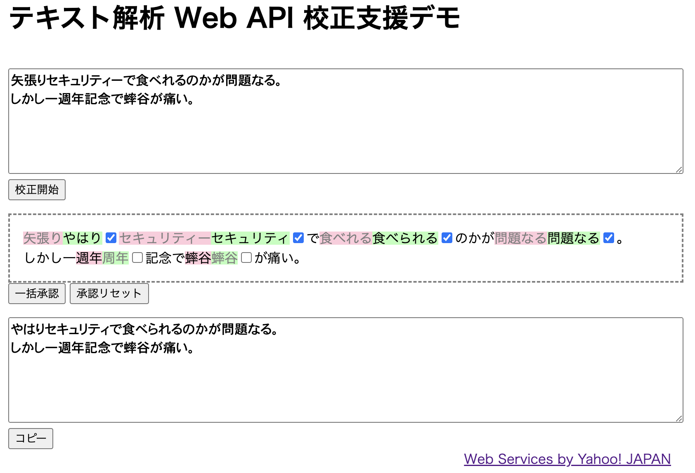

# 1つの HTML ファイルだけで完結する校正支援 API デモページ

約100行のHTMLファイル1つだけから成る、
テキスト解析 Web API を用いた校正支援デモです。
実行環境はウェブブラウザさえあれば OK。
他に何かソフトをインストールする必要もありません。

本記事では、まずは校正支援デモの使い方を説明し、その後にコードの説明をしていきます。

このデモでは、テキスト解析 Web API の「校正支援」機能を使っています。本記事ではこれを「校正支援 API」と呼ぶことにします。

## 校正支援デモの使い方

ブラウザで校正支援デモの HTML ファイル `jlp-kousei-simple.html`（後述）を開きます。

ページには 3 つのエリアが縦に並んでいます。
上から、校正をかけたい文章を入力する「入力テキスト」エリア、
校正支援 API の結果を表示・編集する「出力操作パネル」、
最終稿を表示する「出力テキスト」エリアです。
それぞれの詳細はこのようになっています:

- 「入力テキスト」エリア
  - 校正したいテキストを貼り付ける
  - 「校正開始」ボタンを押す
  - 「出力操作パネル」に結果が出力される
- 「出力操作パネル」
  - 校正支援 API による指摘箇所の入ったテキストが表示される
  - 指摘箇所
    - ピンク背景がオリジナル文字列
      - 校正支援 API に指摘された文字列である
      - クリックすると指摘が否認される（オリジナル文字列が採用される）
    - グリーン背景が変更候補文字列
      - 変更候補がない場合はオリジナル文字列が表示される
      - クリックすると指摘が承認される（変更候補が採用される）
      - 変更候補文字列は編集可能
    - 承認と否認の切り替えはチェックボックスでも可能
    - 指摘箇所にマウスカーソルをあてると、指摘理由がポップアップされる
  - 出力操作パネルの下にあるボタン
    - 「一括承認」ボタンはすべてを承認
    - 「承認リセット」ボタンはすべてを否認
- 「出力テキスト」エリア
  - 「出力操作パネル」の中身に連動した、校正後のテキスト（最終結果）が表示される
  - 「コピー」ボタンでクリップボードにコピーできる

図: 実行例



例文として

```
矢張りセキュリティーで食べれるのかが問題なる。
しかし一週年記念で蟀谷が痛い。
```

を入力してみました（指摘箇所の確認の途中です）。

## コード

校正支援デモ (`jlp-kousei-simple.html`) のソースコードです。
約100行の HTML ファイルとなっています。
少し長いので見づらいかもしれませんがご容赦ください。

```html
<!DOCTYPE html>
<html lang="ja">
  <head>
    <meta http-equiv="Content-Type" content="text/html;charset=UTF-8">
    <meta name="viewport" content="width=device-width, initial-scale=1.0">
    <title>テキスト解析 Web API 校正支援デモ</title>
    <style>
      * { box-sizing: border-box; }
      body { margin: 0; padding: 0 1rem 2rem 1rem; }
      textarea { margin-top: 1rem; width: 100%; height: 8rem; font-size: large; }
      #view { border: dashed 2px gray; padding: 1rem; margin-top: 1rem; }
      del { background-color: #fcd; text-decoration: none; }
      ins { background-color: #bfb; text-decoration: none; color: gray; }
    </style>
    <script>
      const APPID = 'あなたの Client ID（アプリケーション ID）';

      async function kousei_service(text) {
          const url = 'https://jlp.yahooapis.jp/KouseiService/V2/kousei?appid=' + encodeURIComponent(APPID);
          return await fetch(url, {
              method: 'POST',
              body: JSON.stringify({
                  "id": "1234-1",
                  "jsonrpc" : "2.0",
                  "method" : "jlp.kouseiservice.kousei",
                  "params" : { "q" : text }
              }),
              mode: 'cors'
          }).then(res => res.json()).catch(console.error);
      }

      async function do_kousei() {
          const text = document.querySelector("#input-text").value;
          const obj = await kousei_service(text);
          if (!obj) return;
          make_view(text, obj);
          convert_view_to_text();
      }

      function make_view(text, obj) {
          [...obj.result.suggestions].reverse().forEach(s => {
              const pre = text.substring(0, parseInt(s.offset));
              const post = text.substring(parseInt(s.offset) + parseInt(s.length));
              const note = s.rule + (s.note ? ' : ' + s.note : '');
              const sug = s.suggestion ? s.suggestion : s.word;
              text = `${pre}<span title="${note}"><del>${s.word}</del><ins>${sug}</ins>` +
                  `<input type="checkbox"></span>${post}`;
          });
          document.querySelector("#view").innerHTML = text.replaceAll('\n', '<br>\n');
          Array.from(document.querySelectorAll("#view span")).forEach(e => {
              e.querySelector('del').addEventListener('click', () => set_checkbox(e, false));
              e.querySelector('ins').addEventListener('click', () => set_checkbox(e, true));
              e.querySelector('ins').addEventListener('input', () => convert_view_to_text());
              e.querySelector('ins').contentEditable = true;
              e.querySelector('input').addEventListener('change', () => change_suggestion_style(e));
          });
      }

      function change_suggestion_style(e) {
          e.querySelector('del').style.color = e.querySelector('input').checked ? "gray" : "black";
          e.querySelector('ins').style.color = e.querySelector('input').checked ? "black" : "gray";
          convert_view_to_text();
      }

      function convert_view_to_text() {
          const tree = document.querySelector("#view").cloneNode(true);
          Array.from(tree.querySelectorAll('span')).forEach(e =>
              e.querySelector(e.querySelector('input').checked ? 'del' : 'ins').remove());
          document.querySelector("#output-text").value = tree.textContent;
      }

      const set_checkboxes = (checked) =>
            Array.from(document.querySelectorAll('#view span')).forEach(e => set_checkbox(e, checked));
      const set_checkbox = (e, checked) =>
            (e.querySelector('input').checked != checked) && e.querySelector('input').click();
    </script>
  </head>
  <body>
    <h1>テキスト解析 Web API 校正支援デモ</h1>
    <textarea id="input-text" placeholder="入力テキスト"></textarea>
    <button onclick="do_kousei()">校正開始</button>
    <div id="view">出力操作パネル</div>
    <button onclick="set_checkboxes(true)">一括承認</button>
    <button onclick="set_checkboxes(false)">承認リセット</button>
    <textarea id="output-text" placeholder="出力テキスト"></textarea>
    <button onclick="navigator.clipboard.writeText(document.getElementById('output-text').value)">コピー</button>
  </body>
</html>
```

（※）Client ID については[こちら](../02_API_Specifications/00_Overview.md#client-idアプリケーション-id)をご覧ください。

CSS (`<style>...</style>`) と HTML 構造 (`<body>...</body>`) についての詳細説明は割愛します。
`id="input-text"` が入力テキストエリア、
`id="view"` が出力操作パネル、
`id="output-text"` が出力テキストエリアということだけ念頭に置いてください。

JavaScript コードに関しては、処理の流れにそって主だった関数だけ解説します。

入力テキストエリアにテキストを入力したのち「校正開始」ボタンを押すと、
関数 `do_kousei()` が呼ばれます。

`do_kousei()` は入力テキストエリアのテキストを
校正支援 API にかけるため、
関数 `kousei_service()` を呼びます。

`kousei_service()` は校正支援 API を CORS 対応でアクセスし、
結果を JSON オブジェクトで返します。

それをもとに `make_view()` で出力操作パネルを描画します。

ときどき出てくる `convert_view_to_text()` は
出力操作パネルの編集結果を最終稿テキストに変換し出力テキストエリアに表示する関数です。操作によって何かが変更されるたびに呼び出されるため、出力テキストエリアには常に最新のテキストが表示されます。

`make_view()` は校正支援デモの肝となる関数です。
校正支援 API の結果である全指摘箇所 (`suggestions`) を入力テキストに適用します。
具体的には、入力テキスト (Plain text) に対して、
全指摘箇所の承認・否認のスイッチを HTML コードとして挿入していきます。
ここで言うスイッチとは、以下のように指摘箇所全体を `<span>` で、元の表記を `<del>`、変更候補を `<ins>` で囲み、`<input>` を追加したものです。

```
<span title="指摘理由">
<del>元の表記</del>
<ins>変換候補</ins>
<input type="checkbox">
</span>
```

承認・否認は `<input>` (チェックボックス) で行うのですが、
`<del>`, `<ins>` でもクリックイベント発生時に承認・否認を行えるよう `addEventListener` で設定しています。
また、`<ins>` には `contenteditable` 属性をセットしているので、
変更候補が意に沿わない場合に自由に編集することが可能です。

さて、指摘箇所を HTML 化する際にはテキストの後方に位置する指摘箇所から前方のものへと順次処理していきます。
`make_view()` での `suggestions` の `reverse()` がこれにあたります。
なぜ後方から処理するかというと、それぞれの指摘箇所は文字列の開始位置で識別されており、
前方から処理して HTML コードを挿入していくと次の指摘箇所の本来の開始位置が後ろにずれてしまうからです。

以上でコードの全体的な解説を終わります。

コードはこちらから入手できます:

- [jlp-kousei-simple.html](06_KouseiService_CORSDemo_src/jlp-kousei-simple.html)

## おわりに

校正支援 API は、あくまで校正「支援」なので指摘箇所や変更候補は必ずしも正しいわけではありません。
自分の判断で取捨選択する必要があります。
ご留意ください。

## 関連情報

本記事の内容は LINEヤフー Tech Blog でも公開していますので、そちらもぜひご覧ください。

- [1 つの HTML ファイルだけで完結する校正支援ツールの作り方](https://techblog.lycorp.co.jp/ja/20231106a)

## 使用しているテキスト解析 Web API

- [校正支援](../02_API_Specifications/04_KouseiService.md)

## 著者

LINEヤフー研究所  
山下 達雄（[@yto](https://x.com/yto)）
