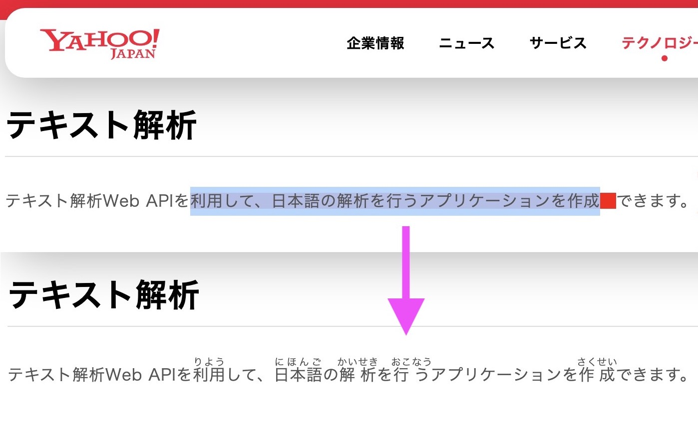

# ブラウザで選択したテキストにルビを振る Chrome 拡張機能

テキスト解析 Web API のルビ振りを使って、
ブラウザで見ているページの任意のテキストにルビを振ります。
Google Chrome のブラウザ拡張機能として実現します。

## 実行例

この Chrome 拡張機能がどう動くのかを説明します。



ブラウザで見ているページ上のテキストを選択すると、
選択箇所の最後に赤い四角が出てきます。
（DOM 構造の関係上、選択できない場合があります。ご了承ください。）

赤い四角をクリックすると、裏でテキスト解析 Web API のルビ振りを呼んでその結果からルビ入り HTML を生成し、選択箇所を置き換えます。

なお、この拡張機能は yahoo.co.jp ドメイン内のみで動作する設定になっています。
設定変更については後述します。

## Chrome 拡張機能の導入方法

Chrome 拡張機能の導入方法を説明します。

- 下記の2つのファイルを同じフォルダに置きます
  - `manifest.json`, `content-script.js`
- Chrome を起動し、chrome://extensions を開きます
- 「パッケージ化していない拡張機能を読み込む」をクリックし、先ほどのファイルを置いたフォルダを開きます
- Chrome の右上の拡張機能アイコンをクリックし、今回の拡張機能をピン留めしておきます

### manifest.json

`manifest.json` は Chrome 拡張機能のための設定ファイルです。このファイルでは基本情報やリソースの指定などを行います。
拡張機能の本体である `content-script.js` を指定しています。
yahoo.co.jp ドメイン以外で動かしたい場合は `matches` を変更してください。

```json
{
    "name": "Furitasi - Add Furigana to Japanese text",
    "description": "Web API Sample Program",
    "version": "1.0",
    "manifest_version": 3,
    "content_scripts": [
        {
            "matches": ["https://*.yahoo.co.jp/*"],
            "js": ["content-script.js"]
        }
    ]
}
```

### content-script.js

`content-script.js` はこの拡張機能の本体です。
ブラウザでページが開かれるとこのファイルが実行されます。

```javascript
const APPID = 'あなたの Client ID（アプリケーション ID）';
async function yapifuri(query) {
    const url = "https://jlp.yahooapis.jp/FuriganaService/V2/furigana?appid=" + encodeURIComponent(APPID);
    const res = await fetch(url, {
        method: 'POST',
        mode: 'cors',
        body: JSON.stringify({
            "id": "A123",
            "jsonrpc" : "2.0",
            "method" : "jlp.furiganaservice.furigana",
            "params" : { "q" : query, "grade" : 1 }
        }),
    });
    return res.json();
}

async function proc_selection() {
    const e = document.querySelector("#selected_text");
    if (! e) return;
    e.innerHTML = e.innerHTML.replace(/<rt>.*?<\/rt>/g,'');
    const j = await yapifuri(e.textContent);
    if (! j.result.word) return;
    e.innerHTML = j.result.word.map(x =>
        x.furigana ?
            `<ruby>${x.surface}<rt>${x.furigana}</rt></ruby>` :
            x.surface
    ).join("");
    unwrap_selection();
}

document.onmouseup = function() {
    const selection = document.getSelection();
    if (selection.isCollapsed) return;
    const range = selection.getRangeAt(0);
    if (range.collapsed) return;

    unwrap_selection();

    const selected_text = document.createElement('span');
    selected_text.id = "selected_text";
    selected_text.style.backgroundColor = 'pink';
    selected_text.onclick = (event) => unwrap_selection();
    range.surroundContents(selected_text);

    const btn = document.createElement('span');
    btn.id = "button_selected_text";
    btn.style.padding = "0 0.5em";
    btn.style.backgroundColor = "red";
    btn.style.cursor = 'pointer';
    btn.onclick = (event) => proc_selection();
    selected_text.after(btn);
};

function unwrap_selection() {
    const e = document.querySelector("#selected_text");
    if (!e) return;
    while (e.firstChild) e.parentNode.insertBefore(e.firstChild, e);
    e.remove();
    document.querySelector("#button_selected_text").remove()
}
```

（※）Client ID については[こちら](../02_API_Specifications/00_Overview.md#client-id%E3%82%A2%E3%83%97%E3%83%AA%E3%82%B1%E3%83%BC%E3%82%B7%E3%83%A7%E3%83%B3id)をご覧ください。

プログラムについて詳細は省いてざっくりとだけ説明します。

- `yapifuri()` はテキスト解析 Web API のルビ振りを呼ぶ関数です
- `proc_selection()` は選択されたテキストに対してルビ振り適用した HTML を生成し、それで選択箇所を上書きする処理を行います
- `document.onmouseup` でマウスでの選択動作が終わったタイミングで起動する処理を定義しています。選択箇所を span タグで囲ったり、ルビ振り発動ボタンを生成したりしています
- `unwrap_selection()` は span タグで囲まれた選択箇所を解除（span タグ削除）する関数です

## おわりに

テキスト解析 Web API のルビ振りの利用例として、選択したテキストにルビを振る Chrome 拡張機能を紹介しました。

コードは[こちら](07_FuriganaService_ChromeExtension_src/)から入手できます。

これをベースすれば、テキスト解析 Web API の他の機能を使った応用が簡単に実現できます。
例えば、
日本語形態素解析を使って選択箇所の日本語文を全てカタカナにする、
キーフレーズ抽出を使って選択テキストから取り出したフレーズでウェブ検索するなど。
いろいろいじってみてください。

## 使用しているテキスト解析 Web API

- [ルビ振り](../02_API_Specifications/03_FuriganaService.md)

## 著者

LINEヤフー研究所  
山下 達雄（[@yto](https://x.com/yto)）
