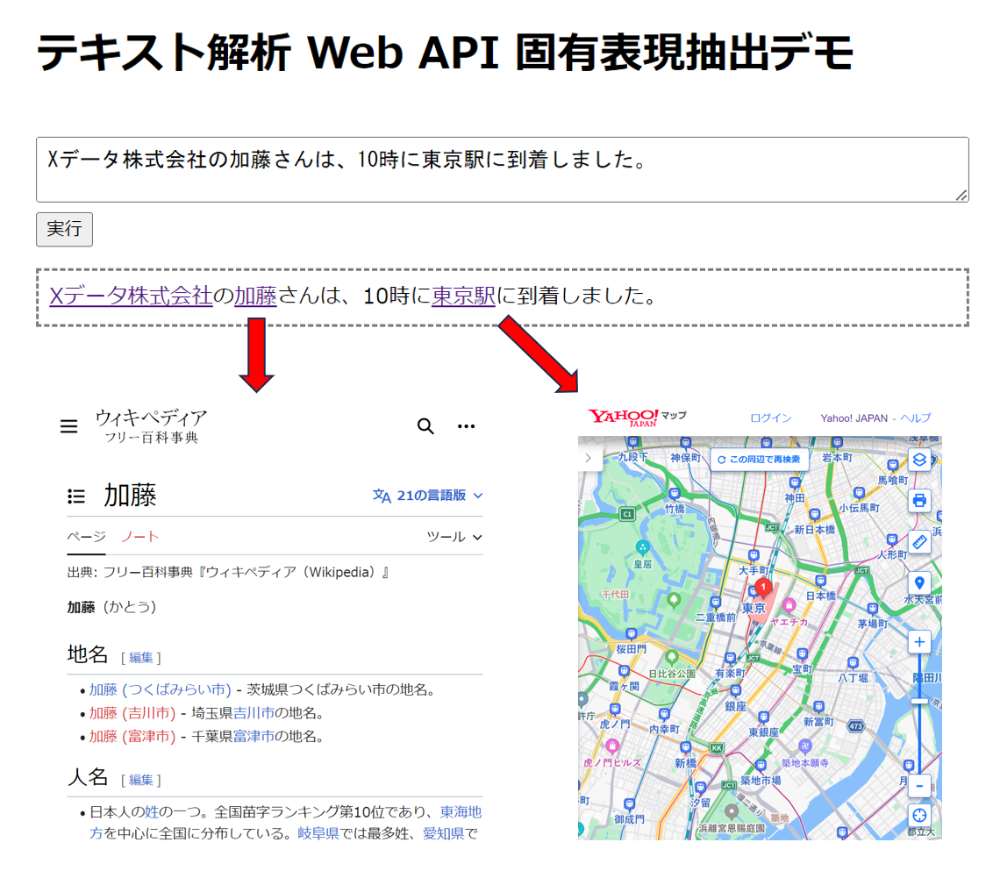

# テキスト中の固有表現に自動でハイパーリンクを張る

テキスト解析 Web API の[固有表現抽出](../02_API_Specifications/08_NERService.md)を使って、テキスト中の固有表現に自動でハイパーリンクを張るデモを紹介します。

固有表現抽出機能は、
ORGANIZATION（組織名）,
PERSON（人名）,
LOCATION（地名）, 
ARTIFACT（固有物名）,
DATE（日付表現）,
TIME（時間表現）,
MONEY（金額表現）,
PERCENT（割合表現）
の8種類の固有表現をテキスト中から抽出します。

本デモではそのうち、
ORGANIZATION（組織名）,
PERSON（人名）,
LOCATION（地名）, 
ARTIFACT（固有物名）の4種類のみ扱います。


## 固有表現抽出デモの使い方

ブラウザで固有表現抽出デモの HTML ファイル `jlp-ner-simple.html`（後述）を開きます。

一番上の「入力エリア」にハイパーリンクを埋め込みたい文章を入力し、
その下の実行ボタンを押すと、
一番下の「出力エリア」にハイパーリンク入りのレイアウト済 HTML テキストが表示されます。

それぞれのハイパーリンクは、
LOCATION の場合は Yahoo!マップのキーワード検索、
ORGANIZATION, PERSON, ARTIFACT の場合はウィキペディアのキーワード検索へのリンクとなっています。

図: 実行例



例文として

```
Xデータ株式会社の加藤さんは、10時に東京駅に到着しました。
```

を入力してみました。
「Xデータ株式会社」と「加藤」はウィキペディア、「東京駅」は Yahoo!マップにリンクされています。

## コード


固有表現抽出デモ (`jlp-ner-simple.html`) のソースコードです。

```html

<!DOCTYPE html>
<html lang="ja">
  <head>
    <meta http-equiv="Content-Type" content="text/html;charset=UTF-8">
    <meta name="viewport" content="width=device-width, initial-scale=1.0">
    <title>テキスト解析 Web API 固有表現抽出デモ</title>
    <style>
      * { box-sizing: border-box; }
      textarea, div { width: 100%; margin-top: 1rem; padding: 0.5rem; font-size: 1rem; }
      #view { border: dashed 2px gray; }
    </style>
    <script>
      const ClientID = 'あなたの Client ID（アプリケーション ID）';

      async function yapiner(query) {
          const url = "https://jlp.yahooapis.jp/NERService/V1/extract?appid=" + encodeURIComponent(ClientID);
          const res = await fetch(url, {
              method: 'POST',
              mode: 'cors',
              body: JSON.stringify({
                  "id": "A123",
                  "jsonrpc" : "2.0",
                  "method" : "jlp.nerservice.extract",
                  "params" : { "q" : query }
              }),
          });
          return res.json();
      }
      async function do_henkan() {
          document.querySelector("#view").innerHTML = '';
          const text = document.querySelector("#input-text").value;
          const obj = await yapiner(text);
          if (! obj?.result?.entityList) return;
          make_view(text, obj);
      }
      function make_view(text, obj) {
          [...obj.result.entityList].reverse().forEach(s => {
              const pre = text.substring(0, parseInt(s.offset));
              const post = text.substring(parseInt(s.offset) + parseInt(s.length));
              if (! /^(ORGANIZATION|PERSON|LOCATION|ARTIFACT)$/.test(s.type)) return;
              const url = (/^LOCATION$/.test(s.type) ? 
                           'https://map.yahoo.co.jp/search?q=' : 
                           'https://ja.wikipedia.org/w/index.php?search=')
                    + encodeURIComponent(s.text);
              text = `${pre}<a target="_blank" href="${url}">${s.text}</a>${post}`;
          });
          document.querySelector("#view").innerHTML = text.replaceAll('\n', '<br>\n');
      }
    </script>
  </head>
  <body>
    <h1>テキスト解析 Web API 固有表現抽出デモ</h1>
    <textarea id="input-text" placeholder="入力エリア"></textarea>
    <button onclick="do_henkan()">実行</button>
    <div id="view">出力エリア</div>

    <div style="text-align: right">
      <!-- Begin Yahoo! JAPAN Web Services Attribution Snippet -->
      <span style="margin:15px 15px 15px 15px"><a href="https://developer.yahoo.co.jp/sitemap/">Web Services by Yahoo! JAPAN</a></span>
      <!-- End Yahoo! JAPAN Web Services Attribution Snippet -->
    </div>
  </body>
</html>
```

（※）Client ID については[こちら](../02_API_Specifications/00_Overview.md#client-idアプリケーション-id)をご覧ください。

コードはこちらでも入手できます:

- [jlp-ner-simple.html](09_NERService_CORSDemo_src/jlp-ner-simple.html)

## おわりに

本記事のコードは
「[1つの HTML ファイルだけで完結する校正支援 API デモページ](./06_KouseiService_CORSDemo.md)」のものをベースにしています。
入力、API アクセス、主力という一連の流れは同じなので、
ウェブブラウザからテキスト解析 Web API を試す際のテンプレートとして流用できるかと思います。


## 使用しているテキスト解析 Web API

- [固有表現抽出](../02_API_Specifications/08_NERService.md)

## 著者

LINEヤフー研究所  
山下 達雄（[@yto](https://x.com/yto)）

