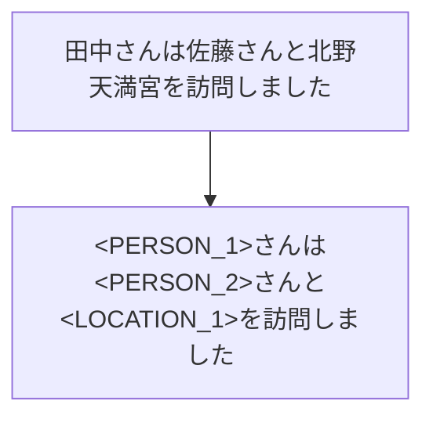

# テキストの固有表現マスキング

## 概要

テキスト解析 Web API の[固有表現抽出](../02_API_Specifications/08_NERService.md)を用いた簡単な固有表現マスキング手法を紹介します。

固有表現抽出機能は、
ORGANIZATION（組織名）、
PERSON（人名）、
LOCATION（地名）、 
ARTIFACT（固有物名）、
DATE（日付表現）、
TIME（時間表現）、
MONEY（金額表現）、
PERCENT（割合表現）
の8種類の固有表現をテキスト中から抽出します。

本手法では、以下の図のように単語ごとに固有表現タグで該当部分をマスキングします。
マスクした部分を復元することも可能です。



## 実装例

それでは Python による例を示していきます。
まず、テキスト解析 Web API の固有表現抽出へリクエストする関数を定義します。

```
import requests
import json

APPID = "あなたの Client ID（アプリケーション ID）"
URL = "https://jlp.yahooapis.jp/NERService/V1/extract"

def get_entities(text):
    # APIリクエストのペイロード
    payload = {
        "jsonrpc": "2.0",
        "id": "1",
        "method": "jlp.nerservice.extract",
        "params": {
            "q": text
        }
    }

    # APIリクエストのヘッダー
    headers = {
        "Content-Type": "application/json",
        "User-Agent": "Yahoo AppID: {}".format(APPID),
    }

    # APIリクエストの送信
    response = requests.post(APIURL, json=payload, headers=headers)

    # レスポンスの解析
    if response.status_code == 200:
        try:
            data = response.json()
            entities = data.get("result", {}).get("entityList", [])
            return entities
        except json.JSONDecodeError as e:
            print("JSONDecodeError:", e.msg)
            return []
    else:
        print("Error: Invalid response")
        return []
```
（※）Client ID については[こちら](../02_API_Specifications/00_Overview.md#client-idアプリケーション-id)をご覧ください。 

次に得られた固有表現を用いてテキストをマスクします。
同じ種類の固有表現であっても、異なる単語に対しては異なるタグでマスクします。
また、その情報は `entity_map` に保持します。

```
def mask_entities(text, entities):
    masked_text = text
    entity_counters = {}
    entity_map = {}

    for entity in entities:
        entity_type = entity["type"]
        if entity_type not in entity_counters:
            entity_counters[entity_type] = 1
        else:
            entity_counters[entity_type] += 1

        tag = f"<{entity_type}_{entity_counters[entity_type]}>"
        entity_map[tag] = entity["text"]
        masked_text = masked_text.replace(entity["text"], tag)

    return masked_text, entity_map
```

最後に `entity_map` を用いてテキストを復元する関数を定義します。

```
def unmask_entities(masked_text, entity_map):
    unmasked_text = masked_text
    for tag, original_text in entity_map.items():
        unmasked_text = unmasked_text.replace(tag, original_text)
    return unmasked_text
```

## 実行例

### ユースケース: 生成AIで議事録を要約（送信する内容は秘匿化）

プロンプト中の議事録の個人名や場所などを自動的にマスキングすることで情報を秘匿化できます。

```
# サンプルテキスト
sample_text = """
2023年12月7日、東京本社の会議室Aにて、プロジェクト「Phoenix」の進捗状況に関するミーティングが行われました。参加者は、プロジェクトマネージャーの田中太郎さん、開発リーダーの山田花子さん、デザインチームの佐藤次郎さん、マーケティング部の鈴木一郎さん、そして外部コンサルタントのジョン・スミスさんです。
まず、田中太郎さんがプロジェクト全体の進捗状況を報告しました。現在、プロジェクトは予定通り進行しており、主要なマイルストーンはすべて達成されています。次に、山田花子さんが開発チームの進捗状況を報告しました。新しい機能の実装は順調に進んでおり、バグ修正もほぼ完了しています。
続いて、佐藤次郎さんがデザインの進捗状況を報告しました。ユーザーインターフェースのデザインはほぼ完成しており、ユーザビリティテストも順調に進んでいます。鈴木一郎さんは、マーケティング戦略について報告しました。新しい広告キャンペーンが開始され、初日の売上は100万円を超えました。また、顧客満足度調査の結果、90％の顧客が新しい製品「Phoenix」に満足していることがわかりました。
ジョン・スミスさんは、外部からの視点でプロジェクトの評価を行いました。彼は、プロジェクトの進捗状況に満足しており、特に開発チームの効率性を高く評価しました。また、彼は今後のリスク管理についても提案を行い、特にサイバーセキュリティ対策の強化を推奨しました。
最後に、田中太郎さんが今後のスケジュールについて説明しました。次回のミーティングは2023年12月21日に予定されており、場所は同じく東京本社の会議室Aです。ミーティングは10時から開始される予定です。参加者全員がスケジュールを確認し、ミーティングは終了しました。
"""

# 固有表現を抽出
entities = get_entities(sample_text)

# 固有表現をマスキング
masked_text, entity_map = mask_entities(sample_text, entities)

# マスクされたテキストを表示
print("Masked Text:", masked_text)
```

> Masked Text:
> <DATE_1>、<LOCATION_1>本社の会議室Aにて、プロジェクト「<ARTIFACT_1>」の進捗状況に関するミーティングが行われました。参加者は、プロジェクトマネージャーの<PERSON_1>さん、開発リーダーの<PERSON_2>さん、デザインチームの<PERSON_3>さん、マーケティング部の<PERSON_4>さん、そして外部コンサルタントの<PERSON_5>さんです。
> まず、<PERSON_1>さんがプロジェクト全体の進捗状況を報告しました。現在、プロジェクトは予定通り進行しており、主要なマイルストーンはすべて達成されています。次に、<PERSON_2>さんが開発チームの進捗状況を報告しました。新しい機能の実装は順調に進んでおり、バグ修正もほぼ完了しています。
> 続いて、<PERSON_3>さんがデザインの進捗状況を報告しました。ユーザーインターフェースのデザインはほぼ完成しており、ユーザビリティテストも順調に進んでいます。<PERSON_4>さんは、マーケティング戦略について報告しました。新しい広告キャンペーンが開始され、<DATE_2>の売上は<MONEY_1>を超えました。また、顧客満足度調査の結果、<PERCENT_1>の顧客が新しい製品「<ARTIFACT_1>」に満足していることがわかりました。
> <PERSON_5>さんは、外部からの視点でプロジェクトの評価を行いました。彼は、プロジェクトの進捗状況に満足しており、特に開発チームの効率性を高く評価しました。また、彼は今後のリスク管理についても提案を行い、特にサイバーセキュリティ対策の強化を推奨しました。
> 最後に、<PERSON_1>さんが今後のスケジュールについて説明しました。次回のミーティングは<DATE_3>に予定されており、場所は同じく<LOCATION_1>本社の会議室Aです。ミーティングは<TIME_1>から開始される予定です。参加者全員がスケジュールを確認し、ミーティングは終了しました。

この Masked Text を 生成AIを使って要約しましょう（プロンプトはご自身で工夫してみてください）。
得られた要約テキストは `summary_text` のようになりました。
ポイントは個人情報などを秘匿化しつつ、生成AIへ情報を送信するところです。
次に、要約されたテキストを復元します。

```
summary_text = """
プロジェクト「<ARTIFACT_1>」進捗状況ミーティング概要
日時: <DATE_1>
場所: <LOCATION_1>本社 会議室A
参加者:

プロジェクトマネージャー: <PERSON_1>
開発リーダー: <PERSON_2>
デザインチーム: <PERSON_3>
マーケティング部: <PERSON_4>
外部コンサルタント: <PERSON_5>
報告内容
プロジェクト全体の進捗（<PERSON_1>）

予定通り進行中
主要なマイルストーン達成
開発チームの進捗（<PERSON_2>）

新機能の実装順調
バグ修正ほぼ完了
デザインの進捗（<PERSON_3>）

ユーザーインターフェースのデザインほぼ完成
ユーザビリティテスト順調
マーケティング戦略（<PERSON_4>）

新広告キャンペーン開始
<DATE_2>の売上が<MONEY_1>を超える
顧客満足度調査で<PERCENT_1>%の顧客が満足
外部評価（<PERSON_5>）

プロジェクト進捗に満足
開発チームの効率性を高評価
サイバーセキュリティ対策の強化を提案
今後のスケジュール
次回ミーティング: <DATE_3>
場所: <LOCATION_1>本社 会議室A
時間: <TIME_1>開始
"""

# 要約文を復元
unmasked_text = unmask_entities(summary_text, entity_map)

# 復元された要約文を表示
print(unmasked_text)
```

> プロジェクト「Phoenix」進捗状況ミーティング概要
>
> 日時: 2023年12月7日
>
> 場所: 東京本社 会議室A
>
> 参加者:
>
> プロジェクトマネージャー: 田中太郎
>
> 開発リーダー: 山田花子
>
> デザインチーム: 佐藤次郎
>
> マーケティング部: 鈴木一郎
>
> 外部コンサルタント: ジョン・スミス
>
> 報告内容
>
> プロジェクト全体の進捗（田中太郎）
> 予定通り進行中
> 主要なマイルストーン達成
>
> 開発チームの進捗（山田花子）
> 新機能の実装順調
> バグ修正ほぼ完了
>
> デザインの進捗（佐藤次郎）
> ユーザーインターフェースのデザインほぼ完成
> ユーザビリティテスト順調
>
> マーケティング戦略（鈴木一郎）
> 新広告キャンペーン開始
> 初日の売上が100万円を超える
> 顧客満足度調査で90%の顧客が満足
>
> 外部評価（ジョン・スミス）
> プロジェクト進捗に満足
> 開発チームの効率性を高評価
> サイバーセキュリティ対策の強化を提案
>
> 今後のスケジュール
>
> 次回ミーティング: 2023年12月21日
>
> 場所: 東京本社 会議室A
>
> 時間: 10時開始

## おわりに
本記事では、テキスト解析 Web API の固有表現抽出を使ってテキスト中の固有表現をマスクする手法と復元する手法を実装しました。
応用事例として議事録の固有表現を秘匿化し、生成 AI で要約した後に復元する例を紹介しました。
今回は固有表現（ ORGANIZATION、PERSON、 LOCATION、 ARTIFACT、 DATE、 TIME、 MONEY、 PERCENT ）をすべてマスクしましたが、一部の固有表現のみをマスクすることも考えられます。

## 使用しているテキスト解析 Web API

- [固有表現抽出](../02_API_Specifications/08_NERService.md)

## 著者

LINEヤフー株式会社 言語処理エンジニア  
舌 達也