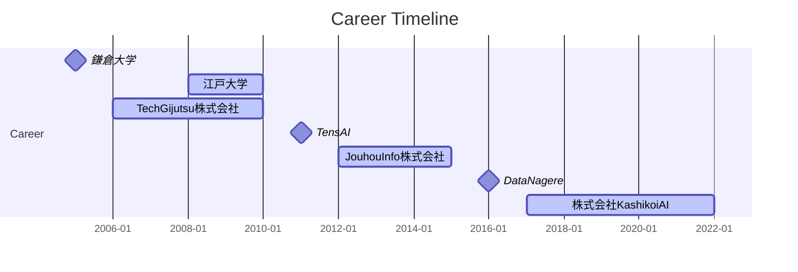

# プロフィールダイアグラムの作成

## 概要

テキスト解析 Web API の[固有表現抽出](../02_API_Specifications/08_NERService.md)を用いてプロフィール文からダイアグラムを作成する手法を紹介します。

この手法では、プロフィール文から固有表現を抽出し、プロフィール図を作成します。
以下は架空のプロフィールに対して本手法を適用した例です。


## 実装例
それでは Python による例を示していきます。
まず、テキスト解析 Web API の固有表現抽出へリクエストする関数を定義します。

```
import requests
import json
import re

APPID = "あなたの Client ID（アプリケーション ID）"
URL = "https://jlp.yahooapis.jp/NERService/V1/extract"

def get_entities(text):
    # APIリクエストのペイロード
    payload = {
        "jsonrpc": "2.0",
        "id": "1",
        "method": "jlp.nerservice.extract",
        "params": {
            "q": text
        }
    }

    # APIリクエストのヘッダー
    headers = {
        "Content-Type": "application/json",
        "User-Agent": "Yahoo AppID: {}".format(APPID),
    }

    # APIリクエストの送信
    response = requests.post(URL, json=payload, headers=headers)

    # レスポンスの解析
    if response.status_code == 200:
        try:
            data = response.json()
            entities = data.get("result", {}).get("entityList", [])
            return entities
        except json.JSONDecodeError as e:
            print("JSONDecodeError:", e.msg)
            return []
    else:
        print("Error: Invalid response")
        return []
```
（※）Client ID については[こちら](../02_API_Specifications/00_Overview.md#client-idアプリケーション-id)をご覧ください。 

次に得られた固有表現のうち、 DATE と ORGANIZATION および ARTIFACT の関係抽出を行います。
ここでは簡単に、先頭からの固有表現の出現順を考慮したルールベースの関係抽出を実装しています。
精度の高い関係抽出にはさらなる工夫が必要です。


```
def extract_relations(entities):
    relations = []
    current_period = None
    waiting_entities = []

    def parse_date(date_str):
        match = re.match(r"(\d{4})年(\d{1,2})月", date_str)
        if match:
            year = match.group(1)
            month = match.group(2).zfill(2)
            return f"{year}-{month}"
        else:
            year_match = re.match(r"(\d{4})年", date_str)
            if year_match:
                year = year_match.group(1)
                return f"{year}-01"
        return None

    for entity in entities:
        if entity["type"] == "DATE":
            date = parse_date(entity["text"])
            if date:
                if current_period:
                    if current_period["end_date"] is None:
                        current_period["end_date"] = date
                    else:
                        relations.append(current_period)
                        current_period = {"start_date": date, "end_date": None, "entities": []}
                else:
                    current_period = {"start_date": date, "end_date": None, "entities": []}
                if waiting_entities:
                    current_period["entities"].extend(waiting_entities)
                    waiting_entities = []
        elif entity["type"] in ["ORGANIZATION", "ARTIFACT"]:
            if current_period:
                current_period["entities"].append(entity["text"])
                relations.append(current_period)
                current_period = None
            else:
                waiting_entities.append(entity["text"])

    if current_period:
        relations.append(current_period)

    return relations
```

最後に抽出した関係をもとに Mermaid コードを生成します。

```
def generate_mermaid(relations):
    mermaid_code = "```mermaid\n"
    mermaid_code += "gantt\n    title Career Timeline\n    dateFormat  YYYY-MM\n    axisFormat %Y-%m\n    tickInterval 1y\n    section Career\n"
    for relation in relations:
        start_date = relation["start_date"]
        end_date = relation["end_date"]
        entities = relation["entities"]
        if end_date:
            for entity in entities:
                mermaid_code += f"    {entity} :active, {start_date}, {end_date}\n"
        else:
            for entity in entities:
                mermaid_code += f"    {entity} : milestone, {start_date}, 1m\n"
    mermaid_code += "```"
    return mermaid_code
```

## 実行例

以下の架空の `profile_text` を図式化してみます。

```
# サンプルプロフィールテキスト
profile_text = """
2005年に鎌倉大学を卒業し、2008年から2010年まで江戸大学に在学しながら、2006年から2010年までTechGijutsu株式会社に在籍。2011年に「TensAI」を開発しリリース。2012年から2015年までJouhouInfo株式会社に在籍した後に、2016年に「DataNagere」をリリース。2017年から2022年まで株式会社KashikoiAIに在籍。
"""

# 固有表現を抽出
entities = get_entities(profile_text)

# 関係を抽出
relations = extract_relations(entities)

# Mermaid形式で図式化
mermaid_code = generate_mermaid(relations)

# Mermaidコードを表示
print(mermaid_code)

# ```mermaid
# gantt
#   title Career Timeline
#   dateFormat  YYYY-MM
#   axisFormat %Y-%m
#   tickInterval 1y
#   section Career
#   鎌倉大学 : milestone, 2005-01, 1m
#   江戸大学 :active, 2008-01, 2010-01
#   TechGijutsu株式会社 :active, 2006-01, 2010-01
#   TensAI : milestone, 2011-01, 1m
#   JouhouInfo株式会社 :active, 2012-01, 2015-01
#   DataNagere : milestone, 2016-01, 1m
#   株式会社KashikoiAI :active, 2017-01, 2022-01
# ```
```

Mermaid コードはそのまま Markdown 形式で図式化できます。


## おわりに
本記事では、テキスト解析 Web API の固有表現抽出を使ってプロフィール中の固有表現からその関係を抽出し、図式化しました。
今回は簡単なルールベースで関係を抽出しましたが、プロフィール中の日付、期間と固有表現のアラインメントの精度向上にはさらなる工夫が必要です。

## 使用しているテキスト解析 Web API

- [固有表現抽出](../02_API_Specifications/08_NERService.md)

## 著者

LINEヤフー株式会社 言語処理エンジニア  
舌 達也