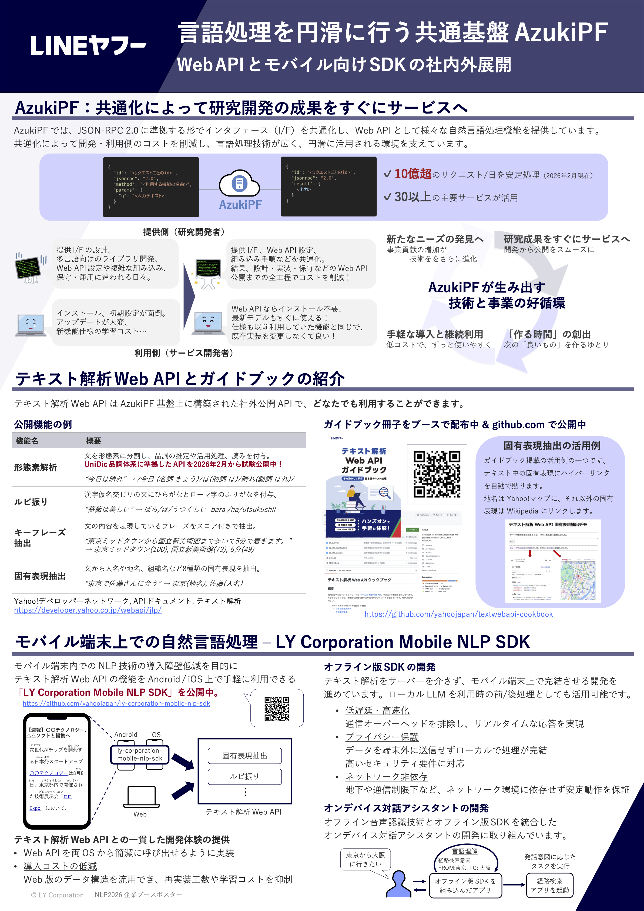

# テキスト解析 Web API 関連ポスター
関連技術のポスター資料を公開しています。

### NLP2026 企業ブースポスター
[言語処理学会第32回年次大会（NLP2026）](https://anlp.jp/nlp2026)の企業ブースにて掲示した共通基盤 AzukiPF の紹介ポスターです。
* タイトル: 言語処理を円滑に行う共通基盤 AzukiPF 〜 Web API とモバイル向け SDK の社内外展開 〜
* ダウンロード: [PDF形式](./assets/nlp2026_azukipf.pdf)

